# Testing

> **Scope**: Complete testing methodology covering thirteen testing types, suite separation for CI behavior, mock-model patterns, QA policy, coverage linkage to requirement IDs, and task specifications for E2E verification, publish preparation, smoke validation, load benchmarking, and final audits.
>
> **Tasks**: E2E_TESTS, PKG_PUBLISH, SMOKE_TESTS, LOAD_TESTS, AUDIT_PLAN, AUDIT_CODE, AUDIT_QA, AUDIT_SCOPE.

## Testing Philosophy

> **Core Principle**: We sacrifice speed of development to ensure nothing breaks when we move forward. Every logic path, every feature boundary, and every failure mode has comprehensive automated verification before code is considered complete.

This philosophy governs all testing decisions across both repositories. It rests on seven pillars.

### Pillar 1 — Incremental Confidence

Every implementation task delivers tests and implementation together. TDD discipline (RED → GREEN → REFACTOR) is non-negotiable. When a module ships, its test coverage ships simultaneously. The system grows in lockstep: no feature exists without corresponding verification. Moving forward means every step lands on proven ground.

### Pillar 2 — Layered Defense

No single testing layer catches all failure modes. Unit tests catch logic errors. Integration tests catch wiring errors. End-to-end tests catch behavioral regressions. Eval tests catch quality degradation. Adversarial tests catch safety bypasses. Property-based tests catch invariant violations. Chaos tests catch resilience gaps. Every critical path is covered by at least three independent layers.

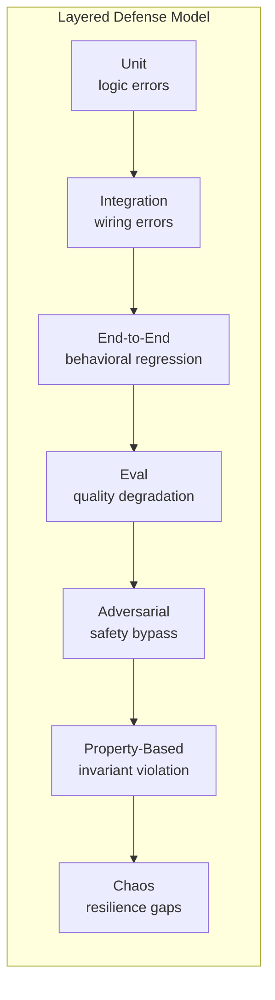

### Pillar 3 — Deterministic Core, Stochastic Edge

The system isolates deterministic orchestration (routing, retries, guardrails, state machines, configuration merging, budget arithmetic, rate limiting) into testable code layers where assertions are exact. LLM outputs are inherently non-deterministic and require eval-based validation rather than assertion-based testing. These two paradigms coexist but never conflate. Deterministic logic uses strict equality assertions. Stochastic output uses threshold-based quality scoring.

### Pillar 4 — Eval as First-Class Citizen

AI agent systems fail differently than traditional software. Output quality degradation, reasoning drift, and emergent misbehavior do not manifest as exceptions. They manifest as subtle changes in response quality that only evaluation can detect. Evaluation datasets are treated as code: version-controlled, reviewed, and maintained. Eval results are compared against defined thresholds, and regressions are failures. Golden datasets grow from production failures, not synthetic scenarios.

### Pillar 5 — Test at the Right Speed

Run cheap tests on every commit. Run expensive tests nightly. Run chaos experiments in staging. Match test execution cost to failure impact. Unit tests gate every push. Integration tests gate release readiness. Eval tests gate quality certification. Load tests gate deployment confidence. This stratification preserves developer velocity while maintaining comprehensive coverage.

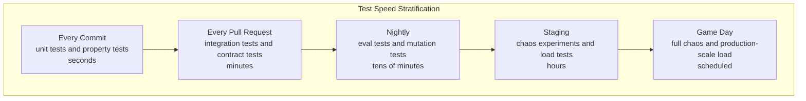

### Pillar 6 — Contract as Boundary

The library and server exist in separate repositories with a clean interface boundary. Consumer-driven contract tests verify that interface changes propagate correctly without requiring full integration test execution. Schema validation catches mismatches at the unit test level. The library defines what it provides. The server defines what it expects. Contract tests verify these promises align.

### Pillar 7 — Embrace Non-Determinism

Rather than fighting LLM variability, testing strategies account for it. Snapshot structure, not content. Evaluate quality, not exact correctness. Use golden datasets with property assertions rather than string matching. Accept that streaming output varies and test format compliance and behavioral invariants instead. For every non-deterministic output, define what properties must hold regardless of the specific text generated.

### The Testing Tax

Every test incurs maintenance cost that compounds over time. The testing philosophy manages this tax deliberately:

- **Unit tests**: near-zero maintenance cost, highest value per line. Write liberally.
- **Integration tests**: moderate maintenance cost, essential for external boundary validation. Write selectively for real integration points.
- **End-to-end tests**: highest maintenance cost, highest confidence per test. Write for critical user flows only.
- **Eval tests**: ongoing curation cost as production reveals new failure modes. Budget for eval maintenance as a continuous activity.
- **Load tests**: minimal maintenance, high infrastructure cost. Run on demand, not continuously.
- **Adversarial tests**: growing corpus, low individual cost. Expand continuously as new attack vectors emerge.

The goal is not maximum test count but maximum confidence per maintenance dollar. Intelligent test selection and layered coverage outperform naive coverage expansion.

## Testing Pyramid

The project uses thirteen testing types organized into three tiers by execution frequency and cost. Every module has unit coverage; critical paths are covered by at least three layers.

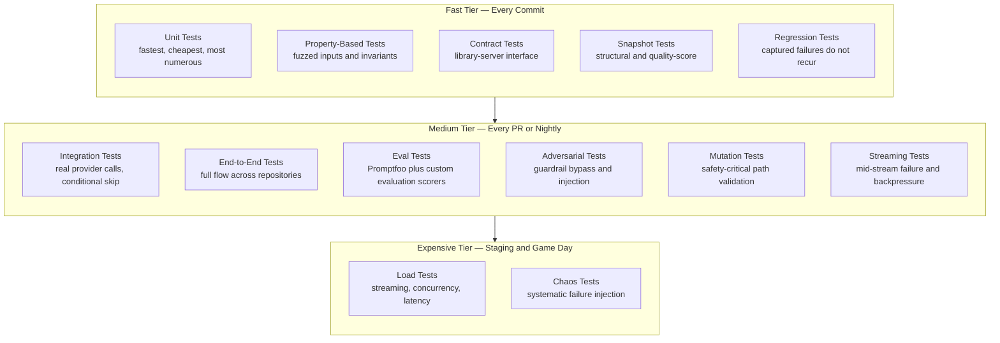

## Test Execution Flow

All suites run through the Bun test runner flow. Selection, discovery, execution, reporting, and evidence capture follow one shared lifecycle.

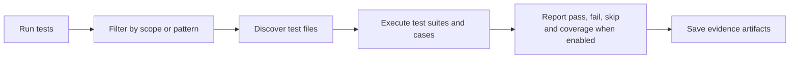

## CI Pipeline

CI follows strict order. Unit tests run first without secrets. Integration tests run only when keys exist. End-to-end and eval stages run after functional gates are green.

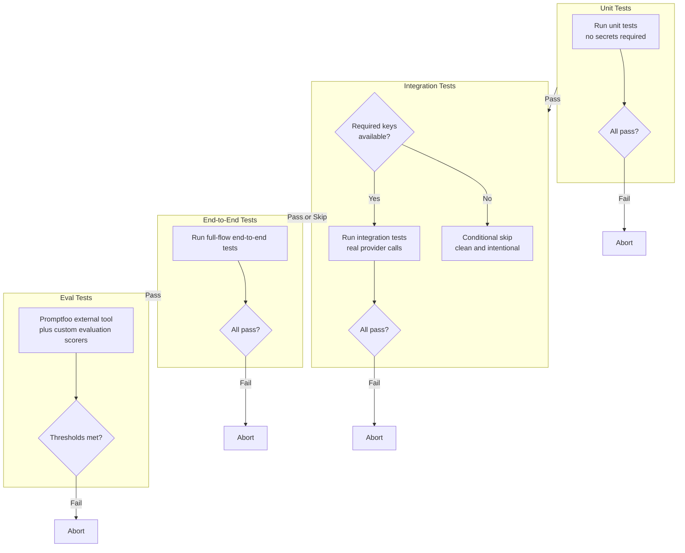

## Test Suite Separation

This is the core testing infrastructure rule: if a unit test fails because of missing secrets, that is a test design bug.

### Boundaries

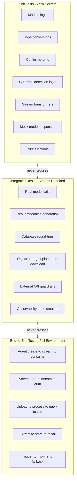

### Rules

**Unit tests** run with zero secrets and no external dependencies. Model behavior is mocked with the AI SDK test mock model. External systems are replaced with stubs or fakes.

**Integration tests** require real keys. Primary provider key is mandatory, secondary keys optional. Every integration test file uses conditional skip at the outermost test group. A plain outer test group in integration scope is a test infrastructure defect.

**End-to-end tests** require complete environment setup: data services, object storage, cache, and at least one provider key. End-to-end suites run in dedicated scope and are not part of the default invocation.

**Spike validation** is integration by definition and may require keys. After the spike, all ongoing implementation must keep unit tests passing with zero keys.

## Mock Model Pattern

All unit tests use the AI SDK test mock model from AI SDK test utilities. The mock supports text streaming, tool calls, and structured outputs without external traffic.

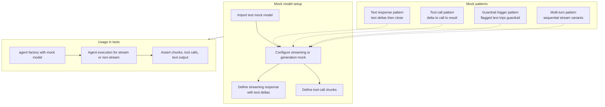

### How Streaming Is Mocked

The mock stream handler returns an object containing a readable stream. Chunks are typed deltas (`text-delta`, `tool-call-delta`, `tool-call`). Stream close marks completion. The raw provider-call payload can be stubbed for metadata assertions.

### How Tool Calls Are Mocked

Tool-call chunks include tool name, call ID, and arguments. The tool executor runs as if a real model requested it. Multi-turn test flows can feed tool results into subsequent mock turns.

### How Guardrail Triggers Are Mocked

Mock output emits known violating text. Streaming guardrails consume sliding windows and either throw tripwire in development or suppress remainder and inject fallback in production. Assertions target resulting stream behavior.

## Unit Tests

**Runner**: Bun test runner.
**Secrets**: None.
**Scope**: Every module, every export boundary, every typed interface edge.

Unit tests are the foundation: fast, deterministic, and infrastructure-independent. Every implementation task delivers tests and implementation together.

### What Gets Unit Tested

- Agent creation defaults and overrides.
- Configuration merge and validation behavior.
- Guardrail detection logic across regex, keyword, and model-assisted paths.
- Severity aggregation with worst-wins behavior.
- Guardrail pipeline orchestration.
- Stream transformation and chunk processing.
- Memory message formatting and turn truncation.
- Document chunking settings.
- Hybrid retrieval query composition.
- Citation schema extraction.
- Rate limiter window arithmetic.
- Circuit breaker state transitions.
- Logger context propagation.
- Token-budget arithmetic.
- CTA catalog validation.
- File validation by type signature and size limits.
- Public export surface stability.

### Mock Strategy

Every external boundary is mocked:

- **Model calls**: controlled AI SDK test mock model behaviors.
- **Database**: in-memory adapters or query-shape assertions.
- **Object storage**: deterministic buffer-return stubs.
- **Cache**: in-memory map-like adapter.
- **MCP servers**: stub transport and tool definitions.
- **Observability export**: no-op sink that captures spans for assertions.

## Integration Tests

**Runner**: Bun test runner with integration scope.
**Secrets**: Primary key required; optional secondary keys supported.
**Scope**: Real provider calls, real database operations, real external integrations.

Integration tests validate real external behavior. They are slower, cost-bearing, and less deterministic than unit suites. They do not gate basic CI green, but they are required before release readiness.

### Conditional Skip Pattern

Every integration file gates its top-level suite with a deterministic conditional skip helper. Missing keys cause clean skips, not failures. Multi-service tests compose key checks with logical conjunctions.

### What Gets Integration Tested

- Streaming with real model responses.
- Guardrail detection on real model outputs.
- Real embedding generation.
- Database round-trips including insert and retrieval.
- Object storage upload, download, and signed-link generation.
- Observability trace creation and score attachment.
- Memory extraction quality under real model behavior.
- Office-document conversion pipeline behavior.
- Rate limiter behavior against a real cache service.

## End-to-End Tests (E2E_TESTS)

**Runner**: Bun test runner with end-to-end scope.
**Secrets**: Full environment.
**Scope**: Complete user-level flows across library and server concerns.

E2E tests validate complete behavior as a user experiences it: create agent, stream response, verify output and side effects. They span agent runtime, transport, memory, guardrails, retrieval, and feedback chain.

### Three-Layer Memory QA Scenarios

- Thread short-term memory: 12 turns in one thread results in the most recent 10 turns plus rolling summary coverage for earlier turns.
- User short-term memory: activity in one thread appears in a new thread for the initial turns.
- User short-term fade-out: after enough turns in the new thread, cross-thread injection stops.
- Rolling summary continuity: long threads with topic switches keep all major topics represented.
- Interaction extraction: search intent becomes interaction memory.
- Media fact extraction: visual message content yields media facts and entity capture.
- Preference correction: corrected preference supersedes prior contradictory preference.
- Structured result memory: ordinal follow-up in new thread resolves to the correct prior result.
- Temporal recall: temporal references trigger time-scoped memory retrieval.
- Recency boost: newer relevant facts outrank older equally similar facts.
- Memory inspect: self-knowledge query returns categorized memory summary.
- Memory delete: requested topic deletion removes matching records and invalidates cache.
- Dependent intents: feedback intent applies before follow-up search intent.
- Cross-thread intent detection: vague new-thread input classifies correctly with cross-thread context.
- Auto-trigger recall: first message in a new thread can trigger automatic recall injection.

### Extraction Safeguard Scenarios

1. Third-party attribution stores interaction signal, not user preference.
2. Sarcasm handling stores correct negative sentiment.
3. Hypothetical statements do not become stored personal facts.
4. Hallucinated prior preference in model output is not extracted as fact.
5. Attribute negation in query constraints excludes conflicting results.
6. Query replay rewrite preserves intent while updating location or facet.
7. Pleasantry short-circuit skips heavy retrieval pipeline.
8. Gibberish short-circuit avoids full pipeline and responds safely.
9. Thread resurrection after long gap triggers recall and staleness context.
10. Rolling summary cap remains within summary-token limit.
11. Context-budget enforcement truncates lower-priority context first.
12. Oversized input is rejected with client-facing validation error.
13. Mid-stream failure skips extraction and avoids partial-fact writes.

**Security scenarios**:

- User isolation: one user never receives another user context.
- Memory deletion purges both long-term records and cache entries.
- Ordinal resolution remains scoped to requesting user.

### Test Matrix

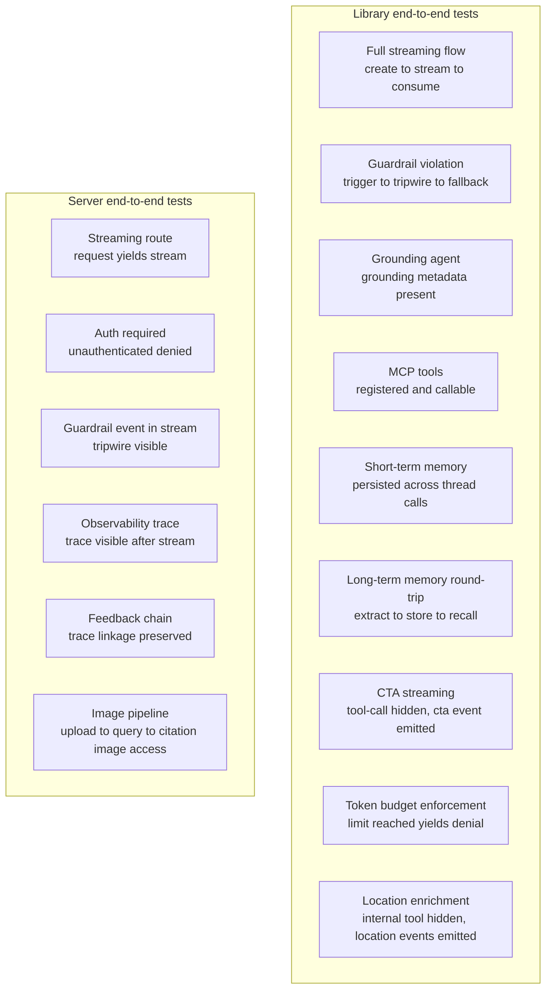

### Long-Term Memory Round-Trip (Critical)

1. Create an agent with fact extraction and recall capabilities.
2. Send preference-bearing user content with user context.
3. Wait for asynchronous extraction completion.
4. Verify stored facts exist for the right user and categories.
5. Open a different thread and ask a recall-triggering query.
6. Assert recall is invoked and prior facts appear in the response context.

This validates extraction to storage to recall across conversation boundaries with correct user scoping.

### Image Pipeline E2E

1. Upload a document that contains raster images.
2. Poll until processing reaches completion.
3. Ask a question requiring visual understanding.
4. Verify citations include image links.
5. Verify inline image references are present in response formatting.
6. Fetch one signed link and verify returned bytes match image signatures.
7. Verify fallback image route behavior redirects correctly.

## Eval Tests

**Runner**: Promptfoo as external development tool plus custom evaluation scorers.
**Secrets**: Keys required for judge-style evaluation.
**Scope**: Output quality, safety quality, retrieval quality.

Eval tests measure response quality rather than only functional correctness. Results are compared to defined thresholds; regressions are failures.

### What Gets Evaluated

- Response relevance.
- Citation accuracy.
- Guardrail precision.
- Guardrail recall.
- Grounding quality.
- Memory recall accuracy.
- CTA relevance.

### Evaluation Thresholds and Baselines

Eval tests compare against defined minimum thresholds. Initial baselines are established during the first evaluation run and tightened as the system matures. Score regression greater than five percentage points from previous baseline triggers test failure regardless of absolute threshold.

| Quality Dimension | Minimum Threshold | Target | Measurement Method |
|---|---|---|---|
| Response relevance | 0.70 | 0.85 | LLM-as-judge scoring against query intent |
| Citation accuracy | 0.80 | 0.95 | Automated verification of cited page content match |
| Safe-input pass-through rate | 0.90 | 0.98 | Rate at which known-safe inputs pass without false blocks |
| Guardrail precision | 0.85 | 0.95 | True positive rate on labeled mixed-safety dataset (correctly identified threats among all flagged inputs) |
| Guardrail recall | 0.85 | 0.95 | Detection rate on known-malicious inputs |
| Grounding quality | 0.75 | 0.90 | Factual accuracy of web-grounded responses |
| Memory recall accuracy | 0.70 | 0.85 | Correct fact retrieval for known-user scenarios |
| CTA relevance | 0.65 | 0.80 | Contextual appropriateness of suggested actions |
| Retrieval precision at ten | 0.75 | 0.90 | Relevant pages in top ten hybrid search results |
| Evidence sufficiency | 0.70 | 0.85 | Gate correctly opens for answerable queries and closes for unanswerable |
| Hallucination rate | Below 0.05 | Below 0.03 | Unsupported claims in generated responses per anti-hallucination architecture |
| Extraction accuracy | 0.75 | 0.90 | Correctly extracted facts from known-fact conversations |
| Rewrite fidelity | 0.85 | 0.95 | All original entities preserved in rewritten queries |

Threshold enforcement:

- Scores below minimum threshold produce test failure that blocks release.
- Scores between minimum and target produce test pass with improvement annotation.
- Scores above target produce clean pass.
- Score regression greater than five points from previous baseline produces failure regardless of absolute threshold.

### Golden Dataset Requirements

- Minimum fifty test cases per quality dimension.
- Cases sourced from real production scenarios where possible.
- Cases reviewed and approved by human evaluator before inclusion.
- Dataset version-controlled alongside test configuration.
- New cases added when production failures reveal gaps not covered by existing cases.
- Dataset refresh cadence: monthly review, quarterly expansion, immediate addition for critical failures.

### Scorer Categories

Scorers are organized into four categories with different sampling strategies:

| Category | Sampling in Production | Purpose |
|---|---|---|
| Safety scorers | Higher sampling rate (up to every request) | Guardrail precision, injection detection, output safety |
| Relevance scorers | Moderate sampling rate | Response relevance, retrieval quality, evidence sufficiency |
| Quality scorers | Lower sampling rate | Citation accuracy, grounding quality, rewrite fidelity |
| Behavioral scorers | Moderate sampling rate | Memory recall, CTA relevance, humanlikeness dimensions |

### Promptfoo Integration

The library provides a Promptfoo provider factory to expose compatible evaluation interfaces. A self-test runner starts an ephemeral service layer, emits evaluation configuration, and evaluation runs externally. Result artifacts are collected for threshold comparison. Custom scorer helpers integrate specialized metrics into the same evaluation pipeline.

## Load Tests (LOAD_TESTS)

**Runner**: k6 as standalone binary.
**Secrets**: Full authenticated environment.
**Scope**: Concurrency behavior, latency baselines, and enforcement behavior under pressure.

Load tests measure system behavior under concurrent demand. They are run on demand and are not CI gates. Initial smoke runs produce baseline measurements that guide future large-scale exercises.

### Architecture

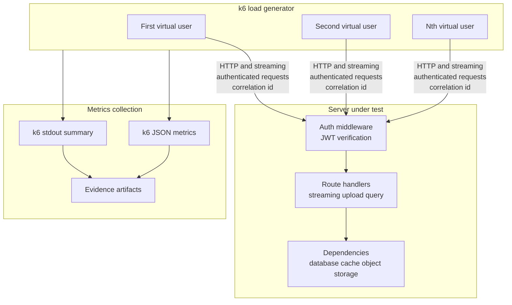

### Script Catalog

Five load scripts cover critical routes:

1. Streaming: concurrent streamed chat, measuring first-token delay and full-stream duration.
2. File upload: concurrent uploads within size and batch constraints, measuring acceptance and processing start.
3. Retrieval query: concurrent retrieval-augmented queries, measuring hybrid retrieval latency.
4. Budget enforcement: rapid same-user requests validating denial after limit and counter consistency.
5. Health baseline: high-rate baseline for p50, p95, and p99 latency.

All scripts share base configuration for endpoint, auth token, and thresholds. Each script includes assertions for status and content behavior.

### Smoke Baselines

Initial smoke runs provide informational baselines:

- Health endpoint p99 target under one hundred milliseconds at low concurrency.
- Streaming route establishes connections and emits measurable first-token timing.
- Upload route accepts requests and initiates processing.
- Budget enforcement denies post-limit requests without concurrency leaks.

### Production-Scale Scenarios

Beyond smoke baselines, load tests scale to production-representative levels for deployment confidence. These scenarios run in staging environments with production-like infrastructure.

| Scenario | Smoke Scale | Production Scale | Metric Focus |
|---|---|---|---|
| Streaming chat | 10 concurrent users | 1000 concurrent users | First-token latency p95, stream completion rate |
| File upload | 5 concurrent uploads | 200 concurrent uploads | Acceptance latency, queue depth, processing throughput |
| Retrieval query | 10 concurrent queries | 500 concurrent queries | Hybrid search latency p95, result quality under load |
| Budget enforcement | 50 rapid requests | 5000 rapid requests per second | Counter accuracy, denial consistency, race condition detection |
| Health baseline | 100 requests per second | 10000 requests per second | p50, p95, p99 latency, error rate |
| Mixed workload | Combined above at ten percent | Combined above at fifty percent | System stability, resource contention, degradation patterns |

### Production-Scale Measurement Targets

Production-scale load tests measure:

- Latency percentiles under sustained load (p50, p95, p99) for each route category.
- Error rate under load with target below 0.1 percent for non-rate-limit errors.
- Resource utilization including CPU, memory, and connection pool usage.
- Degradation curve showing performance change as load increases from ten percent to one hundred percent of target capacity.
- Recovery time measuring how quickly latency returns to baseline after load spike removal.
- Connection pool behavior including exhaustion thresholds, queuing depth, and rejection patterns.
- Cache hit ratio under concurrent access to shared cache keys.
- Budget counter accuracy under concurrent spend with no over-admission beyond one-request tolerance.

### Scalability Breakpoint Detection

- Ramp load linearly from baseline to two times target capacity.
- Identify the inflection point where latency degrades non-linearly.
- Identify the saturation point where error rate exceeds acceptable threshold.
- Document system capacity ceiling for deployment planning.
- Validate horizontal scaling by running the same ramp against two, four, and eight API instances.

### Streaming Load Specifics

Streaming endpoints require specialized load testing because each connection holds server resources for the duration of the response:

- Measure maximum concurrent SSE connections per API instance before resource exhaustion.
- Validate that connection cleanup occurs correctly when clients disconnect mid-stream.
- Test interleaved short and long streams to detect resource contention patterns.
- Verify backpressure behavior when slow consumers accumulate.

## Adversarial Tests

**Runner**: Bun test runner.
**Secrets**: None for pure detection paths; keys only when adversarial integration is required.
**Scope**: Safety bypass attempts, injection, obfuscation, and escalation.

Adversarial tests model attacker behavior. Each guardrail has bypass-attempt tests that prove resistance against common and evolving techniques.

### Attack Categories

- Prompt injection.
- Jailbreak pattern families.
- Unicode obfuscation.
- Token splitting.
- Encoding attacks.
- Multi-turn escalation.
- Context confusion.
- Output manipulation attempts.

### Testing Approach

Unit-level adversarial cases run payloads against individual guardrail functions. Integration-level adversarial cases run payloads through full input-to-output pipelines. Newly discovered bypasses are converted into permanent regression tests.

### Injection-Specific Test Categories

Beyond the general attack categories listed above, prompt injection testing requires dedicated suites.

**Direct injection tests**:
- Role-override attempts.
- System prompt extraction attempts.
- Instruction override prompts that try to supersede prior constraints.
- Delimiter injection that mimics higher-priority message formats.
- Encoding evasion, including base64 payloads, unicode homoglyph substitution, and token-split instructions.
- Multi-language injection attempts in non-primary languages.

**Indirect injection tests via retrieval**:
- Documents with embedded instructions hidden inside otherwise legitimate content.
- Exfiltration payloads in document content, especially URL query strings intended to leak conversation data through image rendering.
- Citation manipulation payloads that attempt to induce false or fabricated citations.
- Gradual context poisoning distributed across multiple retrieved chunks.

**Indirect injection tests via memory**:
- Crafted conversational turns designed to plant instruction-like content as user facts.
- Recall-triggered injection where poisoned memory activates on new-thread auto-recall.
- Memory supersession attacks that attempt to overwrite legitimate memory with injected directives.

**Multi-turn escalation tests**:
- Gradual persona drift over multi-turn windows.
- Privilege escalation sequences that attempt to activate elevated behavior.
- Context window exhaustion followed by late-turn injection payloads.
- Benign setup turns followed by a trigger turn that activates planted context.

**Output-side injection tests**:
- System prompt leakage attempts under multiple extraction prompt styles.
- Attention collapse detection where responses prioritize injected content over the actual user query.
- Exfiltration through generated tool arguments intended to leak sensitive data.

Each test category runs at both unit level for guardrail behavior and integration level for the full input-to-output pipeline. The regression suite expands continuously as new bypass techniques are discovered.

### Security and Concurrency Scenarios

- JWT algorithm confusion attempts are rejected.
- Signed-link leakage prevention prevents unauthorized object access beyond scope and expiry.
- Concurrent quota and budget checks reject over-limit race attempts.
- Per-source outage chaos verifies one failing source does not silently corrupt merged outputs.

## Regression Tests

**Runner**: Bun test runner.
**Secrets**: Depend on original failure context.
**Scope**: Previously observed failures and production-like edge cases.

Every bug fix adds a regression test that fails before the fix and passes after. Regression tests are permanent and remain through refactors.

### Structure

Each regression test documents:

- Original failure behavior.
- Minimal reproduction input.
- Expected post-fix behavior.
- Owning fix task.

Regression tests are co-located with protected modules and marked in test descriptions as regression-focused.

## Property-Based Tests

**Runner**: Bun test runner.
**Secrets**: None.
**Scope**: Invariant validation through randomized input generation.

Property testing validates truths that must hold for all valid inputs, not only hand-picked cases.

### Target Properties

- Configuration merge always retains required fields.
- Severity aggregation always returns highest severity regardless of order.
- Token counting remains non-negative and monotonic with added text.
- Rate-limiter windows align correctly for arbitrary timestamps.
- Citation extraction never yields page values outside document bounds.
- File signature validation avoids false negatives for supported formats.
- Memory truncation always preserves system context and most recent turns.

### Extended Target Properties

Beyond the foundational seven properties, property-based testing covers the modules with deterministic invariants suitable for randomized validation.

**Conversation Pipeline Properties**:

- Intent classification produces valid intent enum values for all generated inputs.
- Rewrite triggers preserve all original entities (names, codes, dates, identifiers) in rewritten output.
- Source priority weighting formula produces weights between zero and one for all source counts.
- RRF fusion scores are non-negative and bounded for all rank combinations.
- Multi-intent decomposition produces at least one sub-query per detected intent count.
- Temporal resolution produces valid date ranges for all temporal phrase patterns with arbitrary timezone offsets.
- Embedding router cosine similarity scores fall between negative one and one for all vector pairs.

**Memory Properties**:

- Fact extraction from user-only content never produces facts attributed to assistant.
- Supersession always preserves audit trail: superseded record exists after every supersession operation.
- Deduplication threshold boundary: similarity exactly at 0.92 produces consistent duplicate detection across repeated evaluations.
- Recency boost multipliers are applied in correct order: 24-hour multiplier greater than 7-day multiplier greater than default.
- Rolling summary token count never exceeds configured maximum after any number of compaction cycles.
- TTL refresh always extends expiry by full TTL duration regardless of current remaining time.
- Emotional context decay counter decrements exactly once per user turn and never goes negative.
- Cross-thread user short-term loading returns at most the configured limit regardless of thread count.

**Document Processing Properties**:

- PDF splitting produces exactly one output per input page for all valid PDFs.
- Chunk overlap is exactly the configured overlap amount for all text lengths above minimum.
- Quota arithmetic never produces negative used_bytes values regardless of operation ordering.
- File status state machine transitions are always unidirectional: no backward transitions for any event sequence.
- Image size filtering correctly accepts at exactly 100 pixels and rejects at 99 pixels for both dimensions.
- Page progress counter increments monotonically and reaches progress_total exactly once.

**Guardrail Properties**:

- Worst-wins aggregation always returns the highest severity in any verdict set regardless of order or count.
- Parallel guardrail execution produces same aggregate result regardless of individual completion order.
- Sliding window buffer size never exceeds configured maximum for any chunk sequence.
- Zero-leak buffer mode never emits bytes to client before buffer reaches configured size or violation is detected.
- Composite guardrail aggregation produces same result regardless of constituent grouping order.
- External guardrail factory with open failure mode never blocks requests on network errors.
- External guardrail factory with closed failure mode always blocks requests on network errors.

**Infrastructure Properties**:

- Rate limiter sliding window calculations produce correct Retry-After for arbitrary timestamp sequences within any window size.
- Circuit breaker state transitions follow valid state machine paths: only closed-to-open, open-to-half-open, half-open-to-closed, and half-open-to-open.
- Budget counter operations maintain atomicity: no intermediate state visible between increment and expiry setting.
- Budget pessimistic reservation followed by reconciliation produces correct final counter value for all estimate-vs-actual combinations.
- Cache TTL expiry is consistent regardless of read access pattern: a key with TTL N expires at the same absolute time whether read zero or one hundred times.

**Transport Properties**:

- SSE event serialization produces valid SSE format for all nine event type variants with arbitrary payload content.
- Verbosity filtering never removes events that should be visible at the configured level and never includes events that should be hidden.
- Stream chunk ordering is preserved through all transformation stages for any interleaving of event types.
- Session-meta event is always emitted exactly once as the first event in any stream regardless of agent behavior.

### Approach

Use a Bun-compatible property testing library or lightweight generators for domain-specific values. Each property executes at least one hundred randomized iterations. Shrinking is preferred but optional.

## Chaos and Failure Testing

**Runner**: Bun test runner with chaos scope, plus infrastructure tools for network-level fault injection.
**Secrets**: Full environment plus fault injection infrastructure.
**Scope**: Systematic failure injection for all external dependencies to verify graceful degradation, fallback paths, and recovery behavior.

Chaos testing intentionally injects faults to uncover weaknesses before they cause production failures. AI agent systems have unique failure modes: LLM provider timeouts cascade differently than database outages, and cache failures affect budget enforcement differently than retrieval quality.

### Chaos Testing Architecture

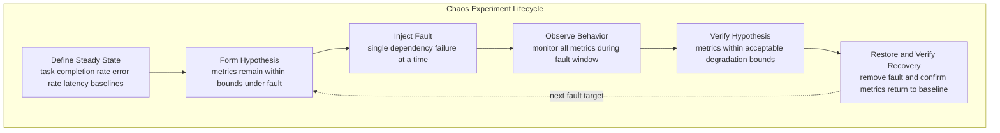

### Fault Injection Matrix

Every external dependency has a defined failure mode, expected system behavior, and recovery verification.

**LLM Provider Faults**:

| Fault | Expected Behavior | Recovery Verification |
|---|---|---|
| Primary key unavailable | Rotate to next key in pool | Response succeeds with different key |
| All keys exhausted | Circuit breaker opens, fast-fail without network calls | Circuit half-opens after timeout, probe succeeds |
| Rate limit response from provider | Exponential backoff with jitter, no circuit trigger | Requests resume after backoff window |
| Timeout with no response | Retry with timeout, circuit opens after threshold consecutive failures | Circuit recovers after reset timeout |
| Malformed response body | Parse error caught, retry once, surface error if persistent | Normal responses resume immediately |
| Context length exceeded response | No retry, surface as client-facing error | Next request with valid length succeeds |

**PostgreSQL Faults**:

| Fault | Expected Behavior | Recovery Verification |
|---|---|---|
| Connection refused | Health endpoint returns down status, all requests return service unavailable | Automatic reconnection on availability, health returns ok |
| Query timeout | Individual request fails with timeout, connection pool remains healthy | Subsequent queries succeed normally |
| Connection pool exhaustion | New requests queue then timeout, no process crash | Pool recovers as long-running queries complete |
| Disk full simulation | Write failures surface as typed errors, reads continue | Writes resume after space recovery |

**SurrealDB Faults**:

| Fault | Expected Behavior | Recovery Verification |
|---|---|---|
| WebSocket connection dropped | Long-term memory disabled, chat continues via short-term only | Auto-reconnect on next operation, memory resumes |
| Query timeout | Memory operation times out, extraction skipped, short-term persists anyway | Subsequent operations succeed |
| Complete unavailability | Graceful degradation to no long-term memory with warning log | Full memory restored on reconnection |

**Valkey Faults**:

| Fault | Expected Behavior | Recovery Verification |
|---|---|---|
| Connection refused | In-memory fallback for cache, per-instance rate limiting, budget fail-open | Valkey reconnection restores global state |
| Response timeout | Individual operation times out, fallback path used | Subsequent operations succeed normally |
| Eviction under memory pressure | Cache misses increase, source-of-truth queries increase | Application remains functional with higher latency |
| Connection restored after outage | No cache stampede, gradual warm-up | Cache hit ratio returns to baseline within minutes |

**Object Storage Faults**:

| Fault | Expected Behavior | Recovery Verification |
|---|---|---|
| Upload failure | Quota reservation rolled back, file marked failed | Retry upload succeeds, quota correct |
| Download timeout during retrieval | Page context assembly degrades gracefully without full request failure | Subsequent downloads succeed |
| Signed URL expired during client access | Client receives clear expiry error, can re-request | New signed URL generated successfully |
| Complete unavailability | File upload and file-backed retrieval disabled, chat continues | Full file capability restored on recovery |

**Background Job Faults**:

| Fault | Expected Behavior | Recovery Verification |
|---|---|---|
| Worker crash mid-task | Job re-enqueued by queue adapter, idempotent re-execution | Document reaches ready or enriched state |
| Duplicate delivery | Idempotent handlers produce same result, no duplicate records | Single set of page_index rows exists |
| Queue unavailable | In-process fallback executes same handlers directly | Background jobs resume when queue returns |

**Observability Faults**:

| Fault | Expected Behavior | Recovery Verification |
|---|---|---|
| Langfuse unavailable at startup | Warning logged, fallback prompts loaded, no-op tracing | Full tracing resumes when Langfuse returns |
| Langfuse unavailable at runtime | No-op scoring, stale-while-revalidate for cached prompts | Score writes resume on recovery |
| Trace flush timeout | Pending telemetry buffered, no request blocking | Buffer flushes on next successful connection |

**LibreOffice Faults**:

| Fault | Expected Behavior | Recovery Verification |
|---|---|---|
| Sidecar unavailable | DOCX conversion fails, file marked failed with clear error | Conversion succeeds when sidecar returns |
| Conversion timeout after thirty seconds | File marked failed, timeout error recorded | Subsequent conversions succeed within timeout |
| Corrupt output | PDF validation catches corrupt output, file marked failed | Re-conversion of same file succeeds |

### Chaos Experiment Execution

Chaos experiments follow a strict protocol to prevent uncontrolled failure propagation:

1. Verify steady state before injection: all health checks pass, baseline metrics within normal range.
2. Inject exactly one fault at a time: never combine failures in a single experiment.
3. Observe for defined duration: minimum thirty seconds, maximum five minutes per fault.
4. Verify hypothesis: check that degradation metrics remain within acceptable bounds.
5. Restore and verify recovery: remove fault and confirm return to baseline within defined recovery window.
6. Document results: capture metrics, behavior observations, and any unexpected side effects.

### Chaos Execution Schedule

- **Unit-level chaos** (every commit): circuit breaker state transitions, retry logic, fallback path selection — all with mocked dependencies.
- **Integration-level chaos** (nightly): TCP-proxy-based fault injection against real services in Docker Compose.
- **Game day chaos** (monthly): multi-fault scenarios, sustained outages, recovery exercises.

## Contract Testing

**Runner**: Bun test runner.
**Secrets**: None (schema validation only).
**Scope**: Consumer-driven contracts between the library and server repositories verifying interface stability.

Contract testing guarantees that interface changes in the library propagate correctly to the server without requiring full integration test execution. The library defines what it provides. The server defines what it expects. Contract tests verify these promises align.

### Contract Testing Architecture

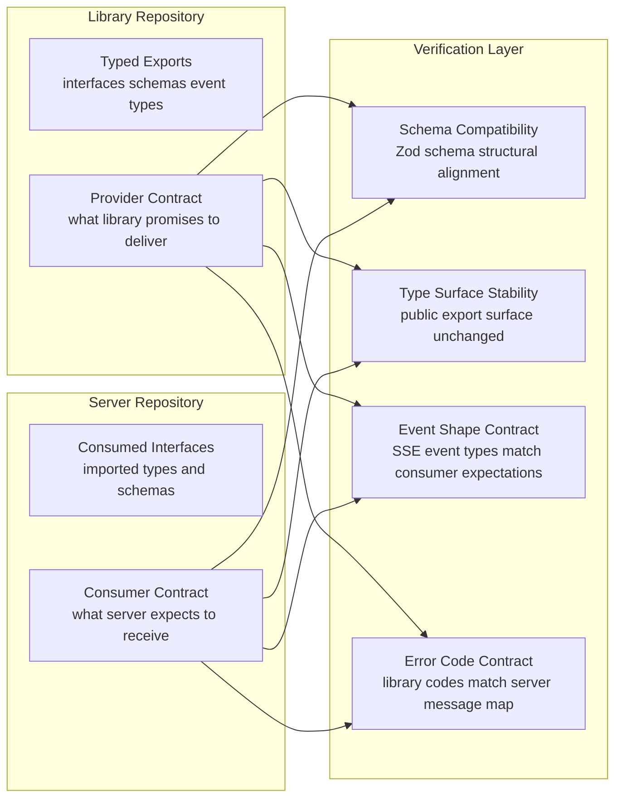

### Contract Areas

Each contract area represents an interface boundary where library and server must agree:

- **SSE event type shapes**: all nine event types (session-meta, text-delta, trace-step, cta, citation, location, tripwire, done, error) with defined Zod schemas validated on both sides.
- **Agent configuration interface**: the configuration object that server passes to library agent factory, validated against library schema.
- **Guardrail pipeline configuration interface**: guardrail function signatures, severity types, verdict shapes.
- **Memory configuration interface**: memory config objects including all numeric thresholds.
- **Storage factory interface**: storage configuration shape and auto-detection contract.
- **Stream event iterator interface**: the async iterable shape returned by agent execution.
- **Error code union**: library emits typed error codes, server maps every code to a message — contract verifies completeness.
- **Typed result patterns**: neverthrow Result type shapes for all boundary operations.
- **Trace-step event discriminated union**: step-specific payload shapes matched between library emission and client SDK consumption.

### Contract Execution

Contract tests run on every commit in both repositories. When the library publishes a new contract artifact, the server CI validates against it. When the server updates its consumer expectations, the library CI validates it can still satisfy them.

Breaking contract changes are detected before they reach integration testing, saving significant feedback time.

## Mutation Testing

**Runner**: Mutation testing framework compatible with Bun.
**Secrets**: None.
**Scope**: Safety-critical paths where undetected mutations could cause security or quality failures.

Mutation testing systematically introduces small changes (mutations) to code and verifies that existing tests catch them. Surviving mutants reveal gaps in test coverage for critical logic.

### Mutation Testing Process

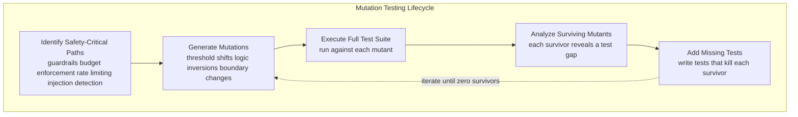

### Mutation Target Paths

Mutation testing focuses exclusively on paths where a missed mutation could cause security, safety, or correctness failures:

- **Input guardrail pipeline**: mutate severity thresholds, detection pattern logic, worst-wins aggregation comparisons.
- **Output guardrail sliding window**: mutate buffer size checks, verdict evaluation logic, chunk suppression conditions.
- **Injection detection ensemble**: mutate tier decision logic (LLM-alone blocks, two-tier flags), parallel execution coordination, blocking threshold comparisons.
- **Memory extraction safeguards**: mutate attribution filter conditions, certainty filter thresholds, injection classifier integration.
- **Content sanitization**: mutate pattern matching expressions, redaction logic, boundary framing insertion.
- **Budget enforcement**: mutate comparison operators in limit checks, reservation increment logic, rollback conditions.
- **Rate limiting**: mutate window boundary calculations, counter increment operations, rejection threshold comparisons.
- **Evidence gate**: mutate sufficiency scoring formula, weight values, threshold comparison operators.
- **File validation**: mutate magic byte comparisons, size limit checks, quota arithmetic.
- **Trust hierarchy enforcement**: mutate trust level assignments, boundary framing conditions, zero-trust content handling.

### Mutation Categories

- **Threshold mutations**: shift numeric boundaries by plus or minus one, by ten percent, to zero, and to maximum value.
- **Logic inversions**: flip boolean conditions, swap AND with OR, invert comparison operators.
- **Boundary shifts**: off-by-one in window sizes, TTL values, limit checks, array indices.
- **Removal mutations**: remove validation steps, skip aggregation stages, omit safety checks.
- **Reorder mutations**: change execution order in pipelines, swap priority levels in aggregation.

### Mutation Testing Schedule

Mutation testing runs nightly against safety-critical paths. Target mutation kill rate is above ninety-five percent for all guarded paths. Surviving mutants are triaged within one business day.

## Snapshot and Golden-File Testing

**Runner**: Bun test runner.
**Secrets**: None for structural snapshots; keys required for golden dataset evaluation.
**Scope**: Non-deterministic LLM outputs validated through structural and quality-score snapshots rather than exact text matching.

Traditional snapshot testing breaks for AI systems because outputs vary between runs. Snapshot testing for this system captures structure, properties, and quality scores rather than raw text content.

### Snapshot Strategy

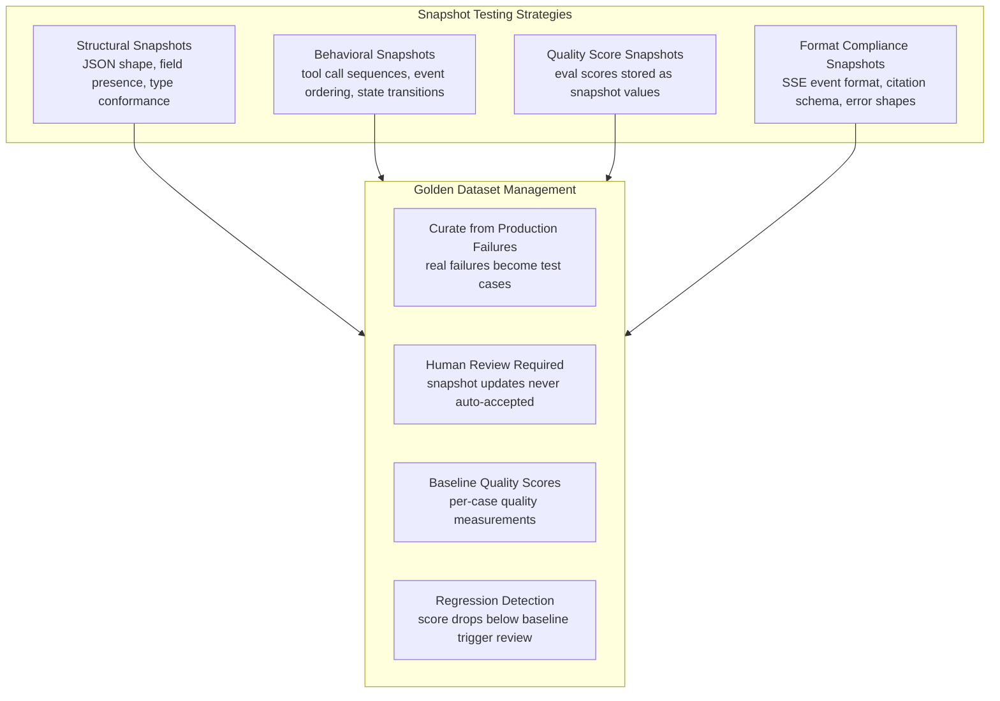

### Structural Snapshots

Structural snapshots validate that output shape is correct without asserting exact content:

- Agent response objects contain all required fields with correct types.
- Citation objects contain source, file identifier, page, and quote fields.
- SSE events conform to their type-specific schemas.
- Tool call sequences match expected tool names and argument shapes.
- Guardrail verdicts contain severity and concept identifier fields.
- Memory extraction results contain fact category, confidence, and temporal state fields.
- Error responses contain error code and message fields matching typed error union.

### Behavioral Snapshots

Behavioral snapshots validate execution patterns rather than output content:

- Multi-intent queries produce expected sub-query decomposition structure.
- Source priority execution produces expected source ordering.
- Dependent intent handling produces expected sequential-then-parallel execution pattern.
- Guardrail pipeline execution produces verdicts in expected aggregation order.
- Memory recall produces expected retrieval-then-ranking pipeline behavior.

### Quality Score Snapshots

For eval-dependent validation, quality scores serve as the snapshot rather than raw text:

- Each golden dataset case has a recorded baseline quality score per dimension.
- Re-evaluation produces scores that are compared against baselines.
- Score drops greater than five percentage points from baseline trigger mandatory human review.
- Score improvements are accepted and baselines are updated after review.
- Quality score history is retained for trend analysis.

### Golden Dataset Lifecycle

- **Initial creation**: minimum fifty cases per quality dimension sourced from realistic scenarios.
- **Expansion**: new cases added when production usage reveals failure modes not covered.
- **Maintenance**: monthly review of cases for continued relevance, quarterly score recalibration.
- **Retirement**: cases removed only when the tested behavior is intentionally changed, with documented justification.

## Streaming-Specific Tests

**Runner**: Bun test runner with streaming scope.
**Secrets**: Mock model for unit-level streaming; keys required for integration streaming tests.
**Scope**: Dedicated testing patterns for SSE streaming behavior covering mid-stream failures, backpressure, reconnection, and protocol compliance.

Streaming responses require specialized testing because they hold server resources for extended durations, involve incremental delivery, and have failure modes that do not exist in request-response patterns.

### Streaming Test Architecture

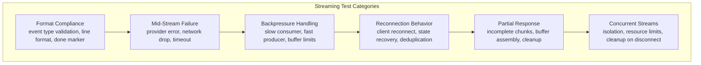

### Format Compliance Tests

- Each of nine SSE event types emits correct structure when serialized.
- Session-meta event is always the first event in every stream.
- Done event is always the last event in every successful stream.
- Error event terminates stream and no further events follow.
- Text-delta events contain only text content, no metadata leakage.
- Trace-step events appear only when verbosity is set to full.
- CTA events contain valid schema: id, label, action type, and optional URL and icon, with maximum three per response.
- Location events contain coordinate data without exposing internal tool call details.
- Tripwire events contain concept identifier and fallback text.

### Mid-Stream Failure Tests

- Provider error during generation: error event emitted, stream closed cleanly, no partial corruption in persisted data.
- Network drop between server and client: server-side cleanup runs, resources released, connection state cleared.
- Guardrail tripwire during stream in production mode: remaining chunks suppressed, fallback message injected, tripwire event emitted.
- Guardrail tripwire during stream in development mode: exception thrown with diagnostic information.
- Provider timeout during generation: stream closed after configured timeout, error event emitted.
- Memory extraction after partial stream: extraction skipped, short-term memory persisted with partial flag.
- Budget accounting after partial stream: actual token count reconciled against estimate, counter corrected.

### Backpressure Tests

- Slow consumer does not crash server or corrupt stream state.
- Server-side buffer limits prevent unbounded memory growth per connection.
- Fast producer with slow consumer: chunks buffered up to limit, then backpressure applied.
- Multiple slow consumers simultaneously: each connection independently managed without cross-contamination.
- Consumer disconnect during backpressure: connection cleanup runs, buffered data released.

### Reconnection Tests

- Client SDK reconnects automatically after connection drop.
- Reconnected client sends the last event identifier on reconnect so the server can resume from where it left off when supported; otherwise the client starts a fresh stream.
- Client SDK offline queue persists messages during disconnection and syncs on reconnect.
- Multiple rapid disconnects and reconnects do not create duplicate connections or leak resources.
- Reconnection with expired authentication token: client re-authenticates before resuming.

### Concurrent Stream Tests

- Multiple simultaneous streams for the same user maintain independent state.
- Each stream tracks its own token budget consumption independently.
- Stream cancellation by one client does not affect other active streams.
- Server resource limits: maximum concurrent streams per user enforced without crash.
- Cleanup on disconnect: all per-connection resources released, no memory leaks across stream lifecycle.

### Zero-Leak Buffer Mode Tests

- Buffer fills to configured size before any bytes reach client.
- Violation detected during buffer phase: entire buffer suppressed, zero bytes sent, fallback injected.
- Buffer fills with no violation: buffer flushed to client, streaming mode begins with sliding window.
- Time-to-first-token delayed by exactly buffer fill duration under normal generation speed.
- Multiple violations during buffer phase: first violation triggers suppression, subsequent violations are no-ops.

## Development Seed Data

Both repositories provide idempotent seed workflows for realistic local test datasets.

**Library seed** populates long-term memory data with user facts, graph relations, and vectors to exercise recall and deduplication behavior.

**Server seed** populates relational metadata, budget data, and representative document assets to exercise retrieval, budget enforcement, and file-management flows.

**Idempotency** is mandatory. Re-running seeds must yield stable state without duplicates or failures.

**Test user scope** uses a dedicated seeded user identity and valid development auth context so testing exercises real auth boundaries.

**Execution rule** requires supporting services to be available; failed dependencies produce explicit seed failure.

## QA Policy

Every implementation task from initial stack setup through final leak prevention includes agent-executed QA scenarios. No manual verification is considered sufficient.

### Evidence Collection

Every QA scenario writes a structured evidence artifact with task and scenario identifiers. Artifacts capture raw outputs proving pass behavior.

### Tool Categories

| Tool Category | Use Case | Description |
|---|---|---|
| Test runner execution | Module assertions | Runs scoped suites through Bun test runner |
| Eval execution mode | Quick export validation | Verifies minimal runtime behavior in isolation |
| Interactive terminal automation | TUI behavior validation | Automates keystrokes and output assertions in terminal sessions |
| HTTP request execution | API and streaming validation | Sends authenticated requests and validates status and payload behavior |

### TDD Discipline

1. RED: write failing behavior test.
2. GREEN: implement minimum behavior to pass.
3. REFACTOR: clean implementation while keeping tests green.

Tests and implementation are inseparable deliverables per task.

### E2E Cleanup

End-to-end suites rely on a cleanup helper that removes thread-associated conversation data, file metadata, retrieval chunks, and long-term memory records. This guarantees isolation without full database reset between runs.

## Task Specifications

### Task E2E_TESTS

**What to do**:

- Create dedicated end-to-end suites for library and server concerns.
- Validate full streaming flow from agent creation to final output consumption.
- Validate guardrail violation behavior across development and production modes.
- Validate grounding mode metadata.
- Validate MCP tool registration and invocation.
- Validate short-term memory persistence across thread turns.
- Validate long-term memory round-trip: extraction, persistence, cross-thread recall.
- Validate server streaming route behavior and auth enforcement.
- Validate guardrail signal visibility in stream events.
- Use Bun runner and mock model where practical to control cost.
- Validate CTA streaming behavior: hidden internal call, visible `cta` event payload.
- Validate observability trace visibility after stream completion.
- Validate feedback linkage from trace identifier to stored score.
- Validate token-budget denial structure at limit.
- Validate image pipeline from upload through query and image citation delivery.

**Must NOT do**:

- Do not require keys for unit tests.
- Do not include TUI rendering assertions in end-to-end suites.

**Depends on**: TUI_AGENT, SELF_TEST, SERVER_AGENT_CFG, SERVER_ROUTES, SERVER_MCP, SERVER_GUARDRAILS, UPLOAD_ENDPOINT, TUI_UPLOAD, DOCKER_COMPOSE, FEEDBACK_ENDPOINT, CLIENT_SDK, COST_TRACKING, AGENT_ROUTER, VALKEY_CACHE, TRIGGER_TASKS, RATE_LIMITING, FILE_CRUD, TTL_CLEANUP, JWT_AUTH, CROSS_CONV_RAG, ADMIN_API.

**Acceptance Criteria**:

- End-to-end suites pass for library scope.
- End-to-end suites pass for server scope.
- Full streaming path validates successfully.
- Guardrail handling is correct in both modes.
- MCP tools are functional.
- Long-term memory round-trip is proven.
- CTA stream cleanliness is proven.
- Trace visibility and feedback chain are proven.
- Token-budget denial response is structured and correct.
- Image lifecycle from upload to citation access is proven.

**QA Scenarios**:

- Full streaming suite validates stream initiation, chunk handling, final output, and evidence capture.
- Server streaming suite validates authenticated stream behavior and evidence capture.
- Image pipeline suite validates visual retrieval, image citation links, byte-signature checks, and fallback behavior.
- Long-term memory suite validates extraction, persistence, and cross-thread recall with evidence capture.

### Task PKG_PUBLISH

**What to do**:

- Prepare concise package documentation with quick start, feature highlights, API overview, config examples, and constraints.
- Ensure root licensing artifacts are complete.
- Ensure package metadata is complete and publish-ready.
- Ensure declaration output is generated for editor tooling.
- Prepare matching metadata and docs for the client SDK package.
- Validate publish dry-run behavior and package contents.
- Validate local install behavior and primary export usability.

**Must NOT do**:

- Do not include unresolved dependency specifiers.
- Do not include test assets in publish payload.
- Do not expand documentation into tutorial-length content.

**Depends on**: BARREL_EXPORTS.

**Acceptance Criteria**:

- Documentation and license artifacts are present and correct.
- Dry-run publish checks succeed for both packages.
- Local install verification succeeds.
- Declarations are generated.

**QA Scenarios**:

- Publishability validation confirms required docs, metadata correctness, dry-run success, local-install behavior, and evidence capture.

### Task SMOKE_TESTS

**What to do**:

- Build smoke workflow covering startup, health behavior, stream behavior, auth denial behavior, and graceful shutdown.
- Define container build behavior for both pre-publish and post-publish modes.
- Add server service integration into compose stack with dependency health ordering.
- Extend environment template with required server variables.
- Enforce auth-secret behavior: development allows explicit bypass mode with warning; production fails closed without secret.
- Provide startup and shutdown automation.

**Must NOT do**:

- Do not add orchestration for out-of-scope platforms.
- Do not add CI pipeline orchestration here.

**Depends on**: SERVER_AGENT_CFG, SERVER_ROUTES, SERVER_MCP, SERVER_GUARDRAILS, UPLOAD_ENDPOINT, DOCKER_COMPOSE, FILE_CRUD, ADMIN_API.

**Acceptance Criteria**:

- Smoke workflow passes health, stream, and auth checks.
- Container build succeeds and runtime health passes.
- Development mode without auth secret starts with clear warning.
- Production mode without auth secret fails startup with clear error.

**QA Scenarios**:

- Smoke validation captures startup, health, stream, and auth evidence.
- Container validation captures build and runtime health evidence.
- Development auth-bypass validation captures warning evidence.
- Production fail-closed validation captures startup rejection evidence.

### Task LOAD_TESTS

**What to do**:

- Create load suite with five scenarios: streaming, upload, retrieval, budget enforcement, health baseline.
- Use pre-generated authenticated context and request-correlation identifiers.
- Create shared threshold configuration.
- Run smoke-scale load passes and capture baseline metrics.
- Save structured output artifacts and summarize findings.
- Treat these scripts as foundation for future larger-scale execution.

**Must NOT do**:

- Do not run production-scale load in this task.
- Do not add k6 as a package dependency.
- Do not block correctness delivery on performance target attainment.
- Do not wire load tests into CI gates.

**Depends on**: SERVER_ROUTES, UPLOAD_ENDPOINT, DOCKER_COMPOSE.

**Acceptance Criteria**:

- Load suite exists with five scenarios and shared config.
- Each scenario runs successfully at smoke scale.
- Health baseline remains within sanity latency target at smoke load.
- Streaming scenario yields stable stream behavior and measurable latency.
- Upload scenario yields acceptance and processing initiation.
- Budget scenario yields deterministic post-limit denials.
- Structured output artifacts are captured per scenario.

**QA Scenarios**:

- Streaming smoke validates pass-rate, check-rate, and stream data continuity.
- Budget smoke validates pre-limit success and post-limit denial correctness under rapid requests.

### Task AUDIT_PLAN

**Depends on**: PKG_PUBLISH.

**Agent**: oracle.

**What to do**:

- Review the plan and implementation end to end.
- Verify every Must Have item has implementation and verification coverage.
- Verify every Must NOT item has no violations.
- Verify evidence artifacts exist for completed tasks.
- Verify deliverables align with plan commitments.

**Acceptance Criteria**:

- Must Have coverage is complete.
- Must NOT violations are zero.
- Task evidence is complete.
- Deliverable alignment is complete.

**Output format**: `Must Have [N/ALL] | Must NOT Have [N/ALL] | Tasks [N/N] | VERDICT: APPROVE/REJECT`.

**QA Scenarios**:

- Complete compliance yields APPROVE.
- Any Must NOT violation yields REJECT with file and line evidence.
- Missing evidence yields REJECT.
- Deliverable mismatch yields REJECT.

### Task AUDIT_CODE

**Depends on**: PKG_PUBLISH.

**Agent**: executor.

**What to do**:

- Execute build, lint, and tests.
- Review changed files for unsafe typing escapes, production logging misuse, empty catches, commented dead blocks, and unused imports.
- Review naming and abstraction quality to detect low-value generated patterns.
- Verify core dependencies are present and correctly wired.
- Verify forbidden storage and formatting patterns are absent.

**Acceptance Criteria**:

- Build has zero errors.
- Lint has zero errors.
- Tests pass.
- Unsafe typing escapes are justified or absent.
- Production logging uses approved logging paths.
- Commented-out dead blocks are absent.
- Low-quality generated-pattern issues are absent.

**Output format**: `Build [PASS/FAIL] | Lint [PASS/FAIL] | Tests [PASS/FAIL] | Files [CLEAN/ISSUES] | VERDICT`.

**QA Scenarios**:

- Clean build, lint, tests, and code quality yields APPROVE.
- Unsafe typing escapes without justification yield REJECT with evidence.
- Production logging misuse yields REJECT with evidence.
- Commented dead blocks yield REJECT with evidence.
- Forbidden storage usage yields REJECT with evidence.

### Task AUDIT_QA

**Depends on**: PKG_PUBLISH.

**Agent**: executor, optionally with browser-automation support if needed.

**What to do**:

- Start from clean environment state with dependencies and service stack.
- Execute every QA scenario from every implementation task.
- Execute cross-task integration checks:
  - Server imports library and starts.
  - Streaming works end to end.
  - Guardrails trigger correctly.
  - MCP tools are available.
  - TUI launches and streams.
  - Eval execution runs.
  - Upload to process to retrieval to citation works.
  - TUI upload command works.
  - Thread isolation is preserved.
  - Cleanup removes all related data.
  - Quota enforcement works.
  - Observability traces appear after stream.
  - Feedback submission links to trace scores.
  - Guardrail scores appear in observability backend.
  - CTA streaming keeps internal calls hidden and emits clean CTA events.
- Save complete evidence set.

**Acceptance Criteria**:

- All per-task QA scenarios pass.
- All fifteen integration checks pass.
- Edge cases are validated and documented.
- Evidence exists for every scenario.

**QA Scenarios**:

- Known-good run produces full pass.
- Intentionally broken guardrail path is detected as failure.
- Upload-to-citation integration path is validated end to end.
- Evidence structure contains one artifact per scenario.

**Output format**: `Scenarios [N/N pass] | Integration [N/15] | Edge Cases [N tested] | VERDICT`.

### Task AUDIT_SCOPE

**Depends on**: PKG_PUBLISH.

**Agent**: deep.

**What to do**:

- For each task from initial stack setup through final visual-grounding scope, compare specification intent and implementation outcome.
- Verify one-to-one scope fidelity: nothing missing, nothing extra.
- Verify Must NOT constraints exhaustively.
- Detect cross-task contamination and unexplained changes.
- Verify absence of forbidden patterns:

| Forbidden Pattern | Why |
|---|---|
| Production persistent storage via unsupported local database path | MN_BUN_SQLITE_PROD |
| Mixed MCP namespacing strategy | MN_MCP_NAMESPACE_COLLISION |
| Model-controlled access filter in retrieval tools | MN_LLM_CONTROLLED_ACCESS |
| Unsupported DOCX parser usage | MN_MAMMOTH |
| Unsupported image library usage | MN_SHARP |
| Legacy image-resize API usage | MN_JIMP_LEGACY |
| Unsupported observability adapter usage | MN_LANGFUSE_OTEL |
| Cloud observability configuration | MN_LANGFUSE_CLOUD |
| Direct query strings for metadata tables where ORM is required | MH_DRIZZLE_ORM |
| Hardcoded CTA catalog in core library | MH_CTA_SERVER_CATALOG |
| Internal CTA tool-call leakage to client stream | MH_CTA_HIDDEN |

**Acceptance Criteria**:

- Every task has one-to-one spec alignment.
- Scope creep is zero.
- Cross-task contamination is zero.
- Forbidden patterns are zero.
- Unaccounted changes are all explained.

**QA Scenarios**:

- Correctly scoped implementation yields full compliance.
- Introduced extra surface area is flagged as creep.
- Missing acceptance implementation is flagged.
- Inserted forbidden pattern is detected and reported.

**Output format**: `Tasks [N/N compliant] | Contamination [CLEAN/ISSUES] | Unaccounted [CLEAN/ISSUES] | VERDICT`.

### FINAL Audit Consolidation Wrapper (Non-Execution)

> This is a consolidation wrapper for final-audit evidence. It is not a separate routed execution task in [Execution Plan](./execution.md).

**Task Name**
- FINAL

**Objective**
- Execute final audit consolidation so release readiness is validated across code quality, test quality, build integrity, and documentation integrity.
- Produce one clear go or no-go decision backed by verifiable evidence from all audit lanes.

**What To Do**
- Aggregate outcomes from plan, code, QA, and scope audits into one release-readiness view.
- Run lint audit to confirm no unresolved policy violations remain.
- Run coverage audit to validate required coverage depth across critical modules.
- Run build audit to confirm all build targets complete without regression.
- Run documentation audit to confirm user-facing and API-facing docs are complete and consistent.
- Reconcile any conflicting findings across audit lanes and classify blocker severity.
- Verify evidence artifacts exist and are traceable for every final audit assertion.
- Produce consolidated verdict with blocker list, waived risks, and remediation ownership.

**Depends On**
- AUDIT_PLAN
- AUDIT_CODE
- AUDIT_QA
- AUDIT_SCOPE
- API_GOVERNANCE

**Batch**
- FINAL_AUDIT_BATCH

**Acceptance Criteria**
- Lint audit confirms zero unresolved quality-gate violations.
- Coverage audit confirms critical-path coverage meets defined thresholds.
- Build audit confirms all required build outputs complete successfully.
- Documentation audit confirms release-facing docs and references are complete and consistent.
- Consolidated report clearly labels blocker, warning, and pass outcomes.
- Final verdict is reproducible from attached evidence artifacts.
- Any approved risk exception includes owner, timeline, and remediation plan.

**QA Scenarios**
- Run final audit with fully clean inputs, verify consolidated pass verdict.
- Introduce lint regression before final audit, verify blocker classification and fail verdict.
- Drop documentation completeness for one release-critical area, verify documentation audit failure is surfaced.
- Reduce critical-path coverage below threshold, verify coverage audit blocks final approval.
- Trigger conflicting sub-audit outcomes, verify reconciliation notes and decision rationale are explicit.

**Implementation Notes**
- Treat FINAL as a release-decision wrapper over upstream audits, not a replacement for them.
- Keep evidence linking strict so each verdict line can be traced to a concrete artifact.
- Prioritize blocker clarity and remediation ownership over verbose narrative.

Per-module test specifications are co-located within each module's plan file under `## Test Specifications`. This ensures test assertions are maintained alongside the features they verify. The Coverage Map below provides the cross-cutting view across all modules.

### Testing Strategy Self-Validation

**Testing infrastructure self-validation**:

- Test mock model emits expected streaming response shapes for deterministic assertions.
- Conditional skip behavior correctly detects missing required keys in keyed suites.
- Evidence capture writes expected artifact outputs for executed scenarios.

**Eval tooling validation**:

- Promptfoo provider helper produces valid evaluation requests.
- Custom scorer interface accepts evaluation inputs and returns numeric scores.

**Seed reproducibility**:

- Repeated seed-data runs are idempotent and produce identical resulting state.

## Coverage Map

Every Must Have feature area maps to one or more testing layers.

| Feature Area | Unit | Integration | End-to-End | Eval | Load | Adversarial | Regression |
|---|---|---|---|---|---|---|---|
| Agent creation and defaults | ✓ |  | ✓ |  |  |  |  |
| Input guardrails | ✓ | ✓ | ✓ | ✓ |  | ✓ | ✓ |
| Streaming output guardrails | ✓ | ✓ | ✓ | ✓ |  | ✓ | ✓ |
| Zero-leak buffered mode | ✓ |  | ✓ |  |  | ✓ | ✓ |
| Guardrail factories | ✓ |  |  |  |  |  |  |
| MCP client wrapper | ✓ | ✓ | ✓ |  |  |  |  |
| Streaming transport | ✓ |  | ✓ |  | ✓ |  | ✓ |
| Grounding search mode | ✓ | ✓ | ✓ | ✓ |  |  |  |
| Short-term memory | ✓ | ✓ | ✓ |  |  |  |  |
| Long-term memory | ✓ | ✓ | ✓ | ✓ |  |  | ✓ |
| Memory recall tool | ✓ |  | ✓ |  |  |  |  |
| Auth middleware | ✓ |  | ✓ |  | ✓ |  | ✓ |
| Trace and thread delivery | ✓ |  | ✓ |  |  |  |  |
| Provider-agnostic configuration | ✓ |  |  |  |  |  |  |
| TUI streaming display | ✓ |  | ✓ |  |  |  |  |
| Promptfoo provider helper | ✓ |  |  | ✓ |  |  |  |
| Custom evaluation scorers | ✓ |  |  | ✓ |  |  |  |
| File upload pipeline | ✓ | ✓ | ✓ |  | ✓ |  |  |
| Multimodal document processing | ✓ | ✓ | ✓ | ✓ |  |  |  |
| Hybrid retrieval | ✓ | ✓ | ✓ | ✓ | ✓ |  |  |
| Structured citations | ✓ | ✓ | ✓ | ✓ |  |  |  |
| Object storage | ✓ | ✓ | ✓ |  | ✓ |  |  |
| File signature validation | ✓ |  |  |  |  |  | ✓ |
| CTA streaming | ✓ |  | ✓ | ✓ |  |  |  |
| Location enrichment | ✓ |  | ✓ |  |  |  |  |
| Rate limiting | ✓ | ✓ |  |  | ✓ |  | ✓ |
| Token budget | ✓ |  | ✓ |  | ✓ |  | ✓ |
| Circuit breaker | ✓ |  |  |  |  |  | ✓ |
| Structured logging | ✓ |  |  |  |  |  |  |
| Observability tracing | ✓ | ✓ | ✓ |  |  |  |  |
| Boundary input validation | ✓ | ✓ | ✓ |  |  | ✓ | ✓ |
| CORS allowlist enforcement | ✓ | ✓ | ✓ |  |  |  | ✓ |
| Role-based authorization | ✓ | ✓ | ✓ |  |  | ✓ | ✓ |
| Audit logging | ✓ | ✓ | ✓ |  | ✓ | ✓ |  |
| User feedback linkage | ✓ |  | ✓ |  |  |  |  |
| ORM and migrations | ✓ | ✓ |  |  |  |  |  |
| Injection detection ensemble | ✓ | ✓ | ✓ | ✓ |  | ✓ | ✓ |
| Content sanitization | ✓ | ✓ | ✓ | ✓ |  | ✓ | ✓ |
| Memory poisoning defense | ✓ | ✓ | ✓ |  |  | ✓ | ✓ |
| Structured result memory | ✓ | ✓ | ✓ |  |  |  |  |
| Cross-conversation retrieval | ✓ | ✓ | ✓ |  |  |  |  |
| Admin API | ✓ |  |  |  |  |  |  |
| Prompt management | ✓ | ✓ |  |  |  |  |  |
| Client offline queue | ✓ |  |  |  |  |  |  |
| Frontend type safety | ✓ | ✓ | ✓ |  |  |  |  |
| OpenAPI documentation | ✓ | ✓ | ✓ |  |  |  |  |
| Correction handling | ✓ |  | ✓ | ✓ |  |  |  |
| Emotional context carry-forward | ✓ |  | ✓ | ✓ |  |  |  |
| Frustration escalation detection | ✓ |  | ✓ | ✓ |  | ✓ | ✓ |
| Repeated question differentiation | ✓ |  | ✓ | ✓ |  |  |  |
| Communication style memory | ✓ | ✓ | ✓ |  |  |  |  |
| Temporal fact markers | ✓ | ✓ |  |  |  |  |  |
| Fact supersession | ✓ | ✓ | ✓ |  |  |  | ✓ |
| Implicit reference resolution | ✓ |  | ✓ | ✓ |  |  |  |
| Response energy matching | ✓ |  | ✓ | ✓ |  |  |  |
| Conversation resumption | ✓ |  | ✓ |  |  |  |  |
| Clarification patience model | ✓ |  | ✓ | ✓ |  |  |  |
| Topic abandonment | ✓ |  | ✓ | ✓ |  |  |  |
| Proactive clarification | ✓ |  | ✓ | ✓ |  |  |  |
| Extension point contracts | ✓ | ✓ | ✓ |  |  |  |  |
| Extension registration validation | ✓ | ✓ |  |  |  |  | ✓ |
| Lifecycle hook system | ✓ | ✓ | ✓ |  |  |  |  |
| Extension security model | ✓ | ✓ |  |  |  | ✓ | ✓ |
| Extension composition patterns | ✓ | ✓ |  |  |  |  |  |
| Contract test suites | ✓ | ✓ |  |  |  |  |  |
| Extension performance budgets | ✓ |  |  |  | ✓ |  |  |
| Checkpoint persistence and recovery | ✓ | ✓ | ✓ |  | ✓ | ✓ | ✓ |
| Time-travel replay and forking | ✓ | ✓ | ✓ | ✓ |  |  | ✓ |
| Background run lifecycle | ✓ | ✓ | ✓ |  | ✓ |  | ✓ |
| HITL approval gates | ✓ | ✓ | ✓ |  |  | ✓ | ✓ |
| Oversight modes and automation ratio | ✓ | ✓ | ✓ | ✓ |  |  | ✓ |
| Escalation and review queue | ✓ | ✓ | ✓ |  | ✓ | ✓ | ✓ |
| Checkpoint TTL, cleanup, and archive | ✓ | ✓ | ✓ |  | ✓ |  | ✓ |
| Concurrent workflow limits and failure isolation | ✓ | ✓ | ✓ |  | ✓ | ✓ | ✓ |
| Semantic cache lifecycle | ✓ | ✓ | ✓ | ✓ | ✓ |  | ✓ |
| Dynamic model routing | ✓ | ✓ | ✓ | ✓ | ✓ |  | ✓ |
| Prompt cache optimization | ✓ | ✓ | ✓ |  | ✓ |  | ✓ |
| Per-agent cost attribution and budgets | ✓ | ✓ | ✓ |  | ✓ |  | ✓ |
| Prompt A/B testing and winner detection | ✓ | ✓ | ✓ | ✓ |  |  | ✓ |
| Atomic bundle rollout and rollback | ✓ | ✓ | ✓ | ✓ |  |  | ✓ |
| Shadow mode behavior comparison | ✓ | ✓ | ✓ | ✓ | ✓ |  | ✓ |
| LLM-as-judge scoring | ✓ | ✓ |  | ✓ |  | ✓ | ✓ |
| Eval dataset governance and tracking | ✓ | ✓ | ✓ | ✓ |  |  | ✓ |
| Experiment regression detection and CI gates | ✓ | ✓ | ✓ | ✓ |  |  | ✓ |
| CLASSic dimension governance | ✓ | ✓ | ✓ | ✓ |  |  | ✓ |
| Threat model and defense-in-depth governance | ✓ | ✓ | ✓ |  |  | ✓ | ✓ |
| OWASP LLM Top 10 coverage | ✓ | ✓ | ✓ |  |  | ✓ | ✓ |
| Decision audit trail and explainability | ✓ | ✓ | ✓ | ✓ |  |  | ✓ |
| DSAR workflow and timeline enforcement | ✓ | ✓ | ✓ |  |  |  | ✓ |
| Breach notification governance | ✓ | ✓ | ✓ |  |  | ✓ | ✓ |
| Consent lifecycle governance | ✓ | ✓ | ✓ |  |  |  | ✓ |
| Bias monitoring and disparate impact detection | ✓ | ✓ | ✓ | ✓ |  | ✓ | ✓ |
| Security audit cadence and dependency scanning | ✓ | ✓ | ✓ |  |  | ✓ | ✓ |
| Content provenance and audit trail | ✓ | ✓ | ✓ |  |  |  | ✓ |
| Disaster recovery and backup | ✓ | ✓ | ✓ |  | ✓ |  | ✓ |
| Agent identity and data residency | ✓ | ✓ | ✓ |  |  | ✓ | ✓ |
| Dynamic fan-out orchestration | ✓ | ✓ | ✓ |  | ✓ |  | ✓ |
| Concurrent request policy | ✓ | ✓ | ✓ |  |  |  | ✓ |
| Deferred tool loading | ✓ | ✓ | ✓ |  |  |  | ✓ |
| Structured output guarantees | ✓ | ✓ | ✓ |  |  |  | ✓ |
| MCP client protocol | ✓ | ✓ | ✓ |  |  |  | ✓ |
| Computer use and browser agents | ✓ | ✓ | ✓ |  | ✓ | ✓ | ✓ |
| Code execution sandboxing | ✓ | ✓ | ✓ |  | ✓ | ✓ | ✓ |
| Real-time voice transport | ✓ | ✓ | ✓ |  | ✓ |  | ✓ |
| RAG feedback loop | ✓ | ✓ | ✓ |  |  |  | ✓ |
| Generative UI tool | ✓ | ✓ | ✓ |  |  |  | ✓ |
| Generative UI SSE protocol | ✓ | ✓ | ✓ |  |  |  | ✓ |
| Generative UI renderer | ✓ | ✓ | ✓ |  |  |  | ✓ |
| Conversation intelligence | ✓ | ✓ | ✓ |  |  |  | ✓ |
| Multi-tenant config hierarchy | ✓ | ✓ | ✓ |  |  |  | ✓ |
| Project onboarding and creation flow | ✓ |  | ✓ |  |  |  | ✓ |
| Progressive API tiers | ✓ | ✓ | ✓ |  |  |  | ✓ |
| Error taxonomy and diagnostics | ✓ | ✓ | ✓ |  |  |  | ✓ |
| Local development environment | ✓ | ✓ | ✓ |  |  |  | ✓ |
| Interactive development studio | ✓ | ✓ | ✓ |  |  |  |  |
| Testing utilities and mock provider | ✓ | ✓ |  |  |  |  | ✓ |
| Template and starter ecosystem | ✓ |  | ✓ |  |  |  | ✓ |
| AI coding agent integration | ✓ |  |  |  |  |  | ✓ |
| TypeScript performance budget | ✓ |  |  |  | ✓ |  | ✓ |
| OpenTelemetry integration | ✓ | ✓ | ✓ |  |  |  | ✓ |
| Tool development workflow | ✓ | ✓ | ✓ |  |  |  | ✓ |
| Public API surface governance |  |  |  |  |  |  | ✓ |
| Stability tier enforcement | ✓ | ✓ |  |  |  |  | ✓ |
| Deprecation lifecycle | ✓ | ✓ | ✓ |  |  |  | ✓ |
| Breaking change protocol | ✓ | ✓ | ✓ |  |  |  | ✓ |
| Migration guide and automated migration tooling | ✓ | ✓ | ✓ |  |  |  | ✓ |
| Consumer upgrade and canary testing | ✓ | ✓ | ✓ |  |  |  | ✓ |
| Extension contract stability | ✓ | ✓ | ✓ |  |  |  | ✓ |
| Type contract governance | ✓ | ✓ |  |  |  |  | ✓ |
| Semantic release policy | ✓ | ✓ | ✓ |  |  |  | ✓ |
| Exception and escalation handling | ✓ | ✓ |  |  |  |  | ✓ |
| Governance operating cadence |  |  |  |  |  |  | ✓ |

## Extended Coverage Map

The six new testing categories provide additional coverage layers beyond the original seven-column map.

| Feature Area | Chaos | Contract | Mutation | Snapshot | Streaming | Property-Based |
|---|---|---|---|---|---|---|
| Agent creation and defaults |  | ✓ |  | ✓ |  | ✓ |
| Input guardrails | ✓ |  | ✓ | ✓ |  | ✓ |
| Streaming output guardrails | ✓ |  | ✓ |  | ✓ | ✓ |
| Zero-leak buffered mode |  |  | ✓ |  | ✓ | ✓ |
| Guardrail factories |  |  | ✓ |  |  | ✓ |
| MCP client wrapper | ✓ | ✓ |  |  |  |  |
| Streaming transport | ✓ | ✓ |  | ✓ | ✓ | ✓ |
| Grounding search mode |  |  |  | ✓ |  |  |
| Short-term memory | ✓ |  |  |  |  | ✓ |
| Long-term memory | ✓ |  | ✓ | ✓ |  | ✓ |
| Memory recall tool |  |  |  | ✓ |  | ✓ |
| Auth middleware |  | ✓ | ✓ |  |  |  |
| Trace and thread delivery |  | ✓ |  | ✓ | ✓ |  |
| Provider-agnostic configuration |  | ✓ |  |  |  | ✓ |
| TUI streaming display |  |  |  |  | ✓ |  |
| Promptfoo provider helper |  |  |  |  |  |  |
| Custom evaluation scorers |  |  |  | ✓ |  |  |
| File upload pipeline | ✓ | ✓ | ✓ |  |  | ✓ |
| Multimodal document processing | ✓ |  |  | ✓ |  | ✓ |
| Hybrid retrieval | ✓ |  | ✓ | ✓ |  | ✓ |
| Structured citations |  |  |  | ✓ |  |  |
| Object storage | ✓ |  |  |  |  |  |
| File signature validation |  |  | ✓ |  |  | ✓ |
| CTA streaming |  | ✓ |  | ✓ | ✓ |  |
| Location enrichment |  |  |  |  | ✓ |  |
| Rate limiting | ✓ |  | ✓ |  |  | ✓ |
| Token budget | ✓ |  | ✓ |  |  | ✓ |
| Circuit breaker | ✓ |  | ✓ |  |  | ✓ |
| Structured logging |  |  |  |  |  |  |
| Observability tracing | ✓ |  |  | ✓ |  |  |
| Boundary input validation | ✓ | ✓ | ✓ |  |  | ✓ |
| CORS allowlist enforcement |  | ✓ |  |  |  |  |
| Role-based authorization |  | ✓ | ✓ |  |  |  |
| Audit logging | ✓ | ✓ | ✓ |  |  |  |
| User feedback linkage |  | ✓ |  |  |  |  |
| ORM and migrations | ✓ |  |  |  |  |  |
| Structured result memory |  | ✓ |  | ✓ |  |  |
| Cross-conversation retrieval |  |  |  |  |  | ✓ |
| Admin API |  | ✓ |  |  |  |  |
| Prompt management | ✓ |  |  |  |  |  |
| Client offline queue |  |  |  |  | ✓ |  |
| Correction handling |  |  |  | ✓ |  |  |
| Emotional context carry-forward |  |  |  |  |  | ✓ |
| Frustration escalation detection |  |  | ✓ |  |  |  |
| Repeated question differentiation |  |  |  | ✓ |  |  |
| Communication style memory |  |  |  |  |  | ✓ |
| Temporal fact markers |  |  |  |  |  | ✓ |
| Fact supersession |  |  | ✓ |  |  | ✓ |
| Implicit reference resolution |  |  |  | ✓ |  |  |
| Response energy matching |  |  |  | ✓ |  |  |
| Conversation resumption | ✓ |  |  |  |  |  |
| Clarification patience model |  |  |  | ✓ |  |  |
| Topic abandonment |  |  |  |  |  |  |
| Proactive clarification |  |  |  | ✓ |  |  |
| Injection detection ensemble | ✓ |  | ✓ |  |  | ✓ |
| Content sanitization |  |  | ✓ |  |  |  |
| Memory poisoning defense |  |  | ✓ |  |  |  |
| Evidence bundle gate |  |  | ✓ |  |  | ✓ |
| SSE event types |  | ✓ |  | ✓ | ✓ | ✓ |
| Verbosity filtering |  | ✓ |  |  | ✓ | ✓ |
| Health endpoint | ✓ |  |  |  |  |  |
| Graceful shutdown | ✓ |  |  |  | ✓ |  |
| Error message mapping |  | ✓ |  |  |  |  |
| Frontend SDK transport |  | ✓ |  | ✓ | ✓ |  |
| React hooks |  | ✓ |  |  |  |  |
| Web components |  |  |  | ✓ |  |  |
| Frontend type safety |  | ✓ |  | ✓ |  |  |
| OpenAPI documentation |  | ✓ |  | ✓ |  |  |
| Accessibility |  |  |  |  |  |  |
| Content provenance |  |  | ✓ |  |  |  |
| Disaster recovery | ✓ |  |  |  |  |  |
| Agent identity and data residency |  | ✓ | ✓ |  |  |  |
| Dynamic fan-out |  |  |  |  |  | ✓ |
| Concurrent request policy |  |  |  |  |  | ✓ |
| Deferred tool loading | ✓ |  |  |  |  |  |
| Structured output guarantees |  | ✓ |  |  |  | ✓ |
| MCP client protocol | ✓ | ✓ |  |  |  |  |
| Computer use and browser agents |  |  |  | ✓ |  |  |
| Code execution sandboxing | ✓ |  | ✓ |  |  | ✓ |
| Real-time voice transport | ✓ |  |  |  | ✓ | ✓ |
| RAG feedback loop |  |  |  |  |  | ✓ |
| Generative UI tool |  | ✓ |  |  | ✓ |  |
| Generative UI SSE protocol |  | ✓ |  |  | ✓ |  |
| Generative UI renderer |  |  |  | ✓ |  |  |
| Conversation intelligence |  |  |  |  |  | ✓ |
| Multi-tenant config hierarchy |  | ✓ |  |  |  | ✓ |
| Project onboarding and creation flow |  |  |  | ✓ |  |  |
| Progressive API tiers |  | ✓ |  | ✓ |  | ✓ |
| Error taxonomy and diagnostics |  |  | ✓ | ✓ |  | ✓ |
| Local development environment | ✓ |  |  |  |  |  |
| Interactive development studio |  |  |  | ✓ |  |  |
| Testing utilities and mock provider |  | ✓ |  |  | ✓ | ✓ |
| Template and starter ecosystem |  |  |  | ✓ |  |  |
| AI coding agent integration |  |  |  | ✓ |  |  |
| TypeScript performance budget |  |  |  |  |  | ✓ |
| OpenTelemetry integration |  | ✓ |  |  |  |  |
| Tool development workflow |  | ✓ |  |  |  |  |
| Public API surface governance |  | ✓ |  | ✓ |  |  |
| Stability tier enforcement |  | ✓ |  | ✓ |  |  |
| Deprecation lifecycle |  |  | ✓ |  |  |  |
| Breaking change protocol |  | ✓ |  |  |  |  |
| Migration guide and automated migration tooling |  |  |  |  |  | ✓ |
| Consumer upgrade and canary testing |  | ✓ |  |  |  |  |
| Extension contract stability |  | ✓ |  |  |  |  |
| Type contract governance |  | ✓ |  | ✓ |  | ✓ |
| Semantic release policy |  | ✓ |  |  |  |  |
| Exception and escalation handling |  |  | ✓ |  |  |  |
| Governance operating cadence |  |  |  |  |  |  |

## Requirement-Level Coverage (MH_*, MN_*)

Coverage is additionally mapped directly to requirement IDs in the Requirements & Constraints document.

### Must Have (MH_*) Coverage Groups

| Requirement Group | Representative IDs | Primary Test Layers |
|---|---|---|
| Agent core | MH_AGENT_DEFAULTS, MH_INPUT_GUARDRAILS, MH_STREAMING_GUARDRAILS, MH_GUARDRAIL_FACTORIES, MH_MCP_CLIENT, MH_SSE_STREAMING, MH_GEMINI_GROUNDING, MH_PROVIDER_AGNOSTIC, MH_CONFIG_OVERRIDABLE, MH_NO_HARDCODED_PROMPTS | Unit, Integration, End-to-End, Eval, Adversarial |
| Language and content safety | MH_LANG_GUARD, MH_HATE_SPEECH_GUARD, MH_LANG_OUTPUT_SCAN, MH_LDNOOBW_ATTRIBUTION, MH_VI_OFFENSIVE_ATTRIBUTION | Unit, Integration, End-to-End, Eval, Adversarial |
| Memory | MH_SHORT_TERM_MEMORY, MH_LONG_TERM_MEMORY, MH_MEMORY_RECALL_TOOL, MH_USERID_SCOPING, MH_NO_WRITES_WITHOUT_USER | Unit, Integration, End-to-End, Eval |
| Auth and transport | MH_JWT_AUTH_REQUIRED, MH_TRACE_THREAD_DELIVERY, MH_ESM_ONLY | Unit, End-to-End, Load |
| TUI | MH_TUI_APP | Unit, End-to-End |
| Evaluation | MH_PROMPTFOO_SELFTEST, MH_EVAL_SCORERS | Unit, Eval |
| Document processing and upload | MH_FILE_UPLOAD, MH_MULTIMODAL_FIRST, MH_PAGE_SUMMARIZATION, MH_PROGRESSIVE_RETRIEVAL, MH_HYBRID_SEARCH_RRF, MH_BACKGROUND_ENRICHMENT, MH_IMAGE_PROCESSING, MH_PAGE_INDEX_TABLE, MH_CUSTOM_QUERY_TOOL, MH_STRUCTURED_CITATIONS | Unit, Integration, End-to-End, Eval, Load |
| Storage and files | MH_S3_STORAGE, MH_FILE_METADATA, MH_MAGIC_BYTES, MH_ASYNC_FILE_PROCESSING, MH_PARTIAL_BATCH_FAILURE, MH_CLEANUP_THREAD, MH_DOCKER_PGVECTOR | Unit, Integration, End-to-End, Load |
| Observability | MH_LANGFUSE_OBSERVABILITY, MH_CUSTOM_SPANS, MH_PII_FILTER, MH_USER_FEEDBACK, MH_LANGFUSE_SELFHOSTED | Unit, Integration, End-to-End |
| Data layer | MH_DRIZZLE_ORM | Unit, Integration |
| CTA streaming | MH_CTA_STREAMING, MH_CTA_SCHEMA, MH_CTA_HIDDEN, MH_CTA_SERVER_CATALOG | Unit, End-to-End, Eval |
| Location enrichment | MH_LOCATION_TOOL, MH_GEOCODE_PLUGGABLE, MH_GEOCODE_CACHED, MH_LOCATION_SUPPRESSED | Unit, End-to-End |
| Infrastructure | MH_RATE_LIMITING, MH_STRUCTURED_LOGGING, MH_FILE_CRUD, MH_TTL_CLEANUP, MH_CIRCUIT_BREAKER, MH_AUTH_MIDDLEWARE | Unit, Integration, End-to-End, Load |
| Humanlikeness | MH_CORRECTION_HANDLING, MH_EMOTIONAL_CONTEXT, MH_FRUSTRATION_DETECTION, MH_REPEATED_QUESTION_DIFF, MH_STYLE_MEMORY, MH_TEMPORAL_FACTS, MH_FACT_SUPERSESSION, MH_IMPLICIT_REFS, MH_RESPONSE_ENERGY, MH_CONVERSATION_RESUMPTION, MH_CLARIFICATION_PATIENCE, MH_TOPIC_ABANDONMENT, MH_PROACTIVE_CLARIFICATION | Unit, Integration, End-to-End, Eval, Adversarial |
| Security and trust | MH_INJECTION_DETECTION, MH_INDIRECT_INJECTION_DEFENSE, MH_SYSTEM_PROMPT_HARDENING, MH_TOOL_ARGUMENT_VALIDATION, MH_ESCALATION_DETECTION, MH_BOUNDARY_INPUT_VALIDATION, MH_ROLE_AUTHZ_REQUIRED, MH_CORS_POLICY, MH_AUDIT_LOGGING | Unit, Integration, End-to-End, Adversarial, Mutation |
| Frontend SDK | MH_REACT_HOOKS, MH_WEB_COMPONENTS, MH_RN_COMPONENTS, MH_TRACE_STEP_EVENTS, MH_VERBOSITY_FILTER, MH_TRACE_UI, MH_VERBOSITY_TOGGLE, MH_FRONTEND_TYPE_SAFETY, MH_AI_ELEMENTS, MH_FRONTEND_A11Y | Unit, Integration, End-to-End, Snapshot |
| Frontend tooling | MH_COMPONENT_CLI, MH_STORYBOOK | Unit, End-to-End |
| Demos | MH_SERVER_SWITCH, MH_DEMO_WEB, MH_DEMO_MOBILE, MH_OFFLINE_MOBILE | End-to-End, Snapshot |
| Type safety and ORM | MH_SURQLIZE, MH_TYPED_ENV, MH_TYPED_ERRORS, MH_NO_RAW_SQL, MH_SECRET_MANAGEMENT | Unit, Integration, audit scans |
| Additional platform | MH_CROSS_CONV_RAG, MH_ADMIN_API, MH_PROMPT_MGMT, MH_ZERO_LEAK, MH_OFFLINE_QUEUE | Unit, Integration, End-to-End |
| Build and development | MH_PRECOMMIT_HOOKS, MH_WATCH_ONLY, MH_OPENAPI_DOCS, MH_SEED_DATA, MH_TYPEDOC, MH_BUN_LINK | Unit, audit scans, End-to-End |

### Must Not (MN_*) Guardrail Coverage Groups

| Exclusion Group | Representative IDs | Detection Layers |
|---|---|---|
| Runtime and compatibility exclusions | MN_BUN_SQLITE_PROD, MN_PROMPTFOO_DIRECT_IMPORT, MN_SHARP, MN_JIMP_LEGACY, MN_AWS_SDK_REDUNDANT, MN_LANGFUSE_OTEL, MN_VERCEL_OTEL, MN_GROUNDING_TOOL_CONFLICT, MN_MCP_NAMESPACE_COLLISION, MN_MCP_DUPLICATE_INSTANCES, MN_OPENTUI_ONKEYPRESS | Unit static checks, audit scans, regression |
| Architecture exclusions | MN_LLM_CONTROLLED_ACCESS, MN_MAMMOTH, MN_SUMMARIES_ONLY, MN_CHUNKS_WITHOUT_SUMMARIES, MN_LOCAL_FILESYSTEM, MN_CROSS_USER_SHARING, MN_MULTI_PROVIDER_ROUTING, MN_HEAVY_ORM, MN_LANGFUSE_CLOUD, MN_LANGFUSE_DATASETS, MN_LANG_GUARD_DEFAULT_ON, MN_SSE_COMPRESSION, MN_CTA_SERVER_RENDER, MN_LOCATION_DEFAULT_IMAGES, MN_SINGLE_LAYER_INJECTION, MN_DELIMITER_ONLY_DEFENSE, MN_UNSCOPED_TOOL_ACCESS, MN_RAW_SQL | Unit, Integration, End-to-End, audit scans |
| Scope exclusions | MN_WORKFLOW_ENGINE, MN_REDIS_STORAGE, MN_UNSUPPORTED_MEDIA, MN_VOICE_AGENT, MN_WEB_DASHBOARD, MN_COMPLEX_MULTI_AGENT, MN_WEBSOCKET, MN_EDGE_RUNTIME, MN_CUSTOM_EMBEDDINGS, MN_WEBHOOKS, MN_AUTO_PROMPT_OPT, MN_CTA_AB_TESTING, MN_COMPLEX_CTA, MN_TUI_IDE_FEATURES, MN_BUN_HOT, MN_RAW_SURREALQL, MN_DIRECT_ENV_ACCESS, MN_ASSISTANT_UI, MN_CUSTOM_THEME, MN_EDEN_PRIMARY, MN_SHARED_JSX | Plan audit, scope audit, code audit |

## Verification Strategy Summary

All verification is automated and agent-executed. The thirteen testing types form a comprehensive strategy governed by the testing philosophy: we sacrifice speed of development to ensure nothing breaks when we move forward.

- Infrastructure baseline: Bun test runner.
- Delivery discipline: RED to GREEN to REFACTOR per task.
- Unit gate: always green with zero secrets.
- Integration gate: conditional skip for missing-key environments.
- Evidence gate: every QA scenario emits evidence artifact.
- Mocking standard: the AI SDK test mock model from AI SDK test utilities.
- Separation: distinct unit, integration, and end-to-end scopes.
- Regression policy: every bug fix adds permanent regression coverage.
- Adversarial policy: every guardrail has bypass-attempt coverage.
- Load policy: k6 scripts exist for critical routes with smoke baselines and production-scale scenarios.
- Eval policy: Promptfoo plus custom scorers validate quality dimensions against defined thresholds.
- Chaos policy: systematic fault injection for all external dependencies verifying graceful degradation and recovery.
- Contract policy: consumer-driven contracts between library and server repositories verifying interface stability on every commit.
- Mutation policy: safety-critical paths (guardrails, budget enforcement, rate limiting, injection detection) validated through mutation testing with ninety-five percent kill rate target.
- Snapshot policy: structural and quality-score snapshots for non-deterministic outputs with human-reviewed updates.
- Streaming policy: dedicated mid-stream failure, backpressure, reconnection, and format compliance tests.
- Property policy: invariant validation through randomized input generation covering modules with deterministic invariants with at least one hundred iterations per property.
- Per-module coverage: every plan document from Requirements through API Governance has explicit test specifications mapping testable behaviors to test layers.

## Cross-Plan References

Testing strategy aligns with and validates every plan document in the structure:

- Requirements source of truth: [Requirements & Constraints](./requirements.md)
- System architecture: [System Architecture](./architecture.md)
- Foundation and shared conventions: [Foundation](./foundation.md)
- Conversation behavior: [Conversation Pipeline](./conversation.md)
- Agents: [Agents & Orchestration](./agents.md)
- Agent capabilities: [Agents & Orchestration](./agents.md)
- Memory design and responsibilities: [Memory & Intelligence](./memory.md)
- Document processing: [Document Processing](./documents.md)
- Retrieval and RAG behavior: [Retrieval & Evidence](./retrieval.md)
- Guardrails and policy enforcement: [Guardrails & Safety](./guardrails.md)
- Transport and event semantics: [Streaming & Transport](./transport.md)
- Server behavior and auth enforcement details: [Server Implementation](./server.md)
- Terminal interface expectations: [TUI App](./tui.md)
- Observability behavior: [Observability](./observability.md)
- Infrastructure operations and capacity planning: [Infrastructure](./infrastructure.md)
- Execution plan and task ordering: [Execution Plan](./execution.md)
- Frontend SDK components and transport: [Frontend SDK](./frontend-sdk.md)
- Demo applications: [Demos](./demos.md)
- Documentation site: [Documentation Site](./documentation.md)
- Release pipeline: [Release Pipeline](./release-pipeline.md)
- Monitoring, alerting, and incident response: [Monitoring, Alerting, and Incident Response](./monitoring.md)
- Coding standards: [Coding Standards](./coding-standards.md)
- Extensibility and plugin architecture: [Extensibility](./extensibility.md)
- Durable execution and HITL oversight: [Durable Execution and HITL](./durable-execution.md)
- AI operations and prompt lifecycle governance: [AI Operations](./ai-operations.md)
- Security strategy and compliance operations: [Security & Compliance](./security-compliance.md)
- Developer experience and onboarding: [Developer Experience](./developer-experience.md)
- API governance and consumer migration: [API Governance](./api-governance.md)

## External References

- Bun test runner: https://bun.sh/docs/cli/test
- k6 load testing: https://grafana.com/docs/k6/latest/
- k6 streaming and realtime APIs: https://grafana.com/docs/k6/latest/javascript-api/k6-experimental/websockets/
- Promptfoo: https://promptfoo.dev/docs
- AI SDK testing utilities: https://sdk.vercel.ai/docs/ai-sdk-core/testing
- Pact contract testing: https://docs.pact.io/
- fast-check property testing: https://fast-check.dev/
- Toxiproxy fault injection: https://github.com/Shopify/toxiproxy#readme
