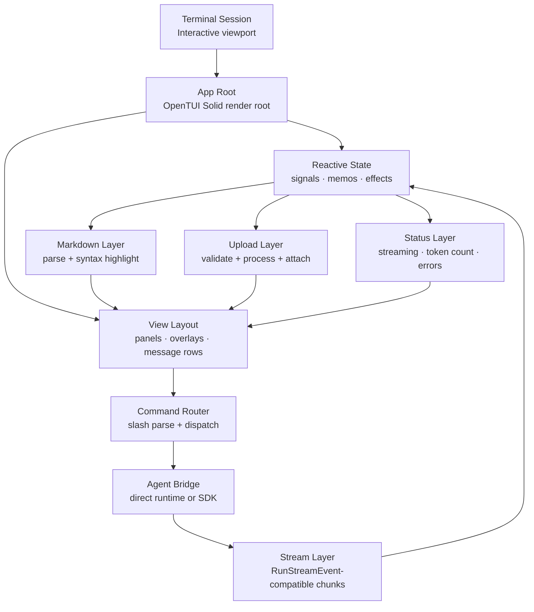
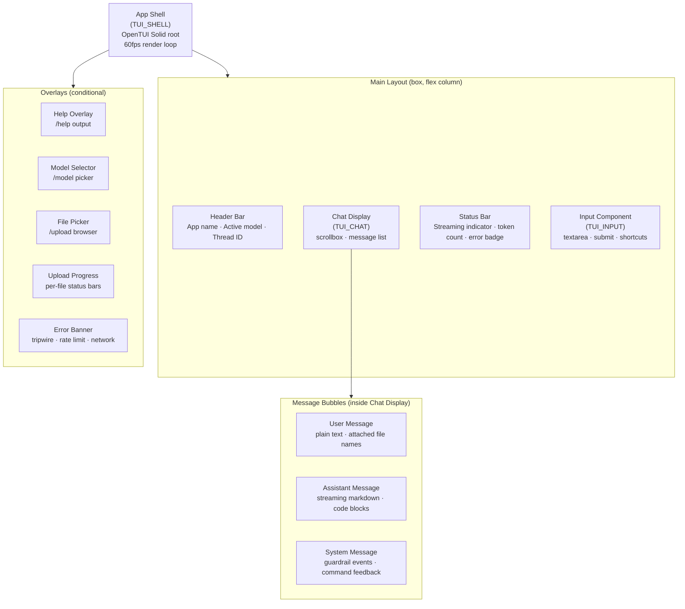
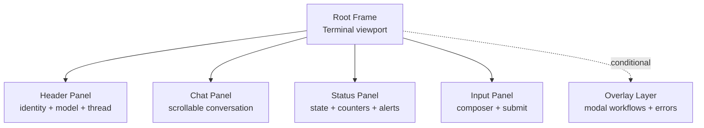
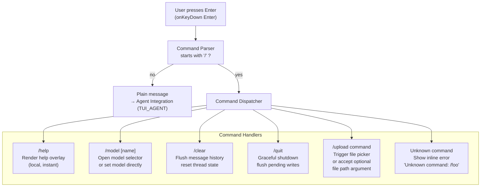
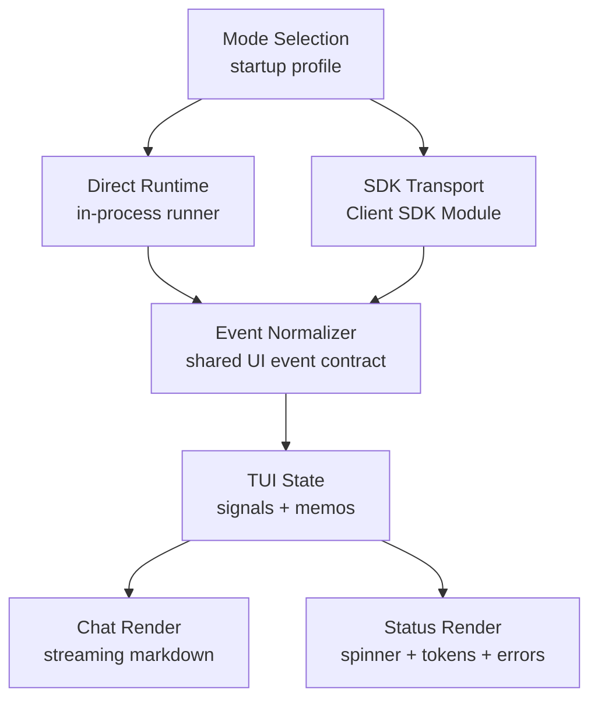
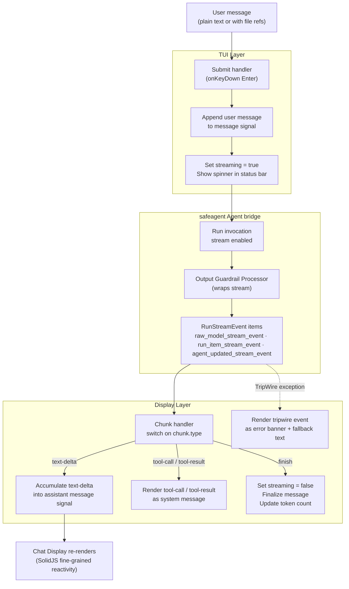
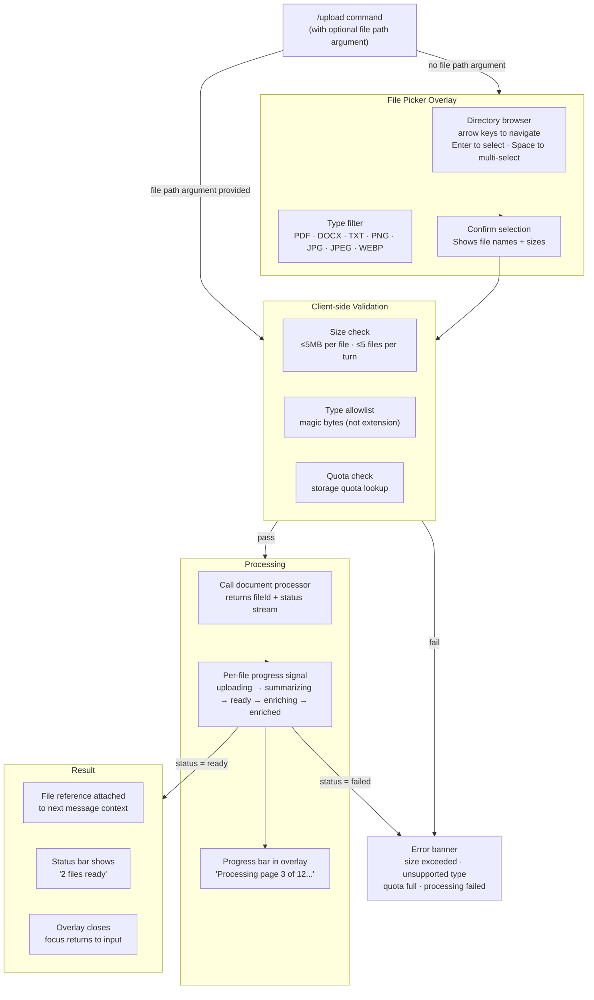
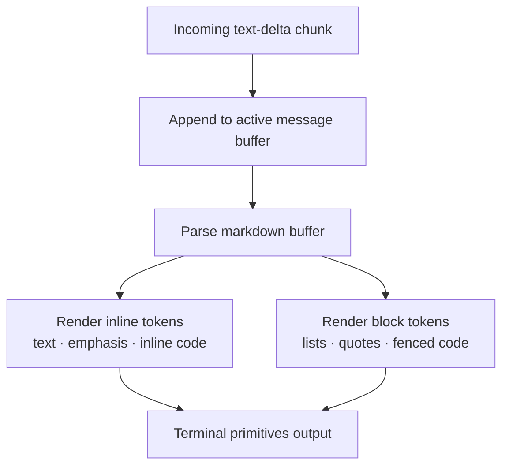

# TUI App

> **Scope**: The OpenTUI Solid terminal application. A full-featured chat client that talks to the safeagent layer, renders streaming markdown, handles slash commands, supports file uploads, and runs in either direct runtime mode or remote SDK mode.
>
> **Tasks**: TUI_SHELL (App Shell), TUI_CHAT (Chat Display), TUI_INPUT (Input Component), TUI_COMMANDS (Command System), TUI_AGENT (Agent Integration), TUI_UPLOAD (Upload Command)

## Overview

The TUI is a first-class client for safeagent, not a demo and not a thin wrapper. It targets the same quality bar as the rest of the product: streaming markdown with syntax highlighting, real-time status indicators, guardrail event display, and file upload with progress feedback. Users who prefer the terminal get the full experience.

The TUI is built with OpenTUI Solid, a SolidJS reconciler for OpenTUI's native Zig terminal core. It runs at 60fps, uses reactive signals for state, and renders JSX to terminal primitives.

The client supports two execution paths with the same UX contract:

- Direct runtime mode: consumes framework stream events from agent execution API in-process.
- Remote SDK mode: uses the client SDK module with transport-aligned stream semantics.

Both modes preserve identical chat behavior, command behavior, upload behavior, and guardrail behavior.

## OpenTUI Solid Architecture

OpenTUI Solid manages terminal rendering while SolidJS manages reactive state transitions. The application layer coordinates user input, command routing, stream consumption, markdown rendering, file processing feedback, and status surfaces.

## Component Tree

The application is a single render tree rooted at the App Shell. Every visible element is a child of that shell.

## Screen Layout and Panels

The shell renders a full-screen layout with four persistent panels and a conditional overlay layer.

- Header panel: app identity, active model, thread context.
- Chat panel: full message timeline and streaming output.
- Status panel: streaming indicator, token count, attachment readiness, errors.
- Input panel: multiline composer and command entry.
- Overlay layer: help, model selector, file picker, upload progress, error banner.

## Keyboard Binding Matrix

Keyboard handling is centralized, deterministic, and based on `onKeyDown`.

| Key | Scope | Action |
|-----|-------|--------|
| Enter | Input | Submit message or command |
| Shift+Enter | Input | Insert newline |
| Ctrl+C | Global/Input | Cancel stream or quit via guarded behavior |
| Ctrl+L | Global | Clear message state and pending attachments |
| Up arrow | Input | Recall previous input from history |
| Down arrow | Input | Recall next input from history |
| Tab | Input | Autocomplete slash command and cycle matches |
| Escape | Global/Overlay | Dismiss overlays and banners |

## Command Routing

All slash commands are intercepted before input reaches the agent. The command router parses the first token, dispatches to the matching handler, and either resolves immediately (local commands) or starts an async flow (agent-touching commands).

## Client SDK Integration (Client SDK module)

The TUI supports remote execution through the client SDK module while preserving first-party terminal behavior. The SDK path is transport-backed, but it keeps the same event semantics and rendering semantics as direct runtime mode.

Responsibilities in SDK mode:

- Session initialization and authenticated stream setup.
- Streaming event consumption with the same internal event handling contract.
- Error mapping to terminal-native error surfaces.
- Upload initiation and progress integration with the same status model.

## Agent Integration Flow

The TUI consumes stream events and pipes them into reactive signals that drive visible rendering.

## File Upload Flow

The `/upload` command opens file selection or accepts an inline path argument. Selected files are validated client-side, then sent through document processing, and finally attached to the next chat turn when ready.

## Markdown Rendering and Syntax Highlighting

Markdown rendering is stream-aware and continuously updates as text arrives. The parser and renderer are designed for incremental growth of the active assistant message.

The renderer supports:

- Paragraphs and line breaks.
- Inline code with background highlight.
- Fenced code blocks with language-aware syntax highlighting.
- Bold and italic emphasis.
- Ordered and unordered lists.
- Blockquotes.

Only the currently streaming message re-renders on each chunk, which avoids expensive full-list redraw behavior.

## Theme System

The theme system uses semantic style tokens rather than hardcoded per-component colors. This keeps rendering consistent across header, chat, status, input, overlays, and markdown blocks.

Primary token groups:

- Surface and foreground contrast.
- Header and status accents.
- User, assistant, and system message variants.
- Success, warning, and error states.
- Code block and inline code styling.
- Focus and selection emphasis.

Theme changes do not reset state, interrupt streams, or clear overlays.

## App Shell (TUI_SHELL)

The App Shell is the root component. It owns the render loop, top-level layout, and global keyboard handler. Everything else mounts inside it.

### OpenTUI Solid Setup

OpenTUI Solid is a SolidJS reconciler that renders JSX to terminal primitives instead of the DOM. The setup has three mandatory pieces that must all be present for rendering to work.

**Type configuration** must set `jsxImportSource` to `@opentui/solid`, not `solid-js`. Using the wrong import source compiles JSX against the wrong renderer and yields no terminal output.

**Runtime preload configuration** must include `@opentui/solid/preload`. This preload wires SolidJS reactive primitives to the OpenTUI renderer. Without it, reactive state can update while terminal rendering stays blank. The preload scope must stay local to the TUI context.

**Entry rendering** invokes OpenTUI Solid `render` with a root component function. The renderer then takes control of terminal lifecycle and frame updates.

### Layout

The shell renders a full-screen box with a flex-column layout. From top to bottom: header bar, chat display (flex-grow), status bar, input component. Overlays render conditionally above the base layout.

### Global Keyboard Handler

The shell registers one root `onKeyDown` handler. It intercepts global shortcuts (quit, clear, dismiss) before they reach child components. Child components register local `onKeyDown` handlers for component-specific actions.

`onKeyDown` is the correct event. `onKeyPress` is not used because it does not fire in this runtime path.

### 60fps Render Target

OpenTUI's native core targets 60fps. The SolidJS reconciler batches signal updates within a frame and flushes them together. Rapid stream chunks do not cause visible tearing or flicker.

## Chat Display (TUI_CHAT)

The Chat Display renders conversation history plus the currently streaming assistant response. It is a scrollbox containing a reactive list of message components.

### Message Rendering

Each message entry maps to a message component.

- User messages: plain text with colored prefix.
- Assistant messages: markdown rendering.
- System messages: distinct style for guardrail and command feedback.

Markdown rendering handles:

- Paragraphs and line breaks.
- Inline code.
- Fenced code blocks with syntax highlighting.
- Bold and italic emphasis.
- Ordered and unordered lists.
- Blockquotes.

### Streaming Rendering

While the agent streams, the current assistant message is a live signal. Each `text-delta` appends to that signal. Fine-grained reactivity updates only the currently streaming message, not the entire list.

### Auto-Scroll

Auto-scroll follows new content while the user stays at the bottom. If the user scrolls up, auto-scroll pauses. It resumes when the user returns to the bottom.

### Code Block Rendering

Code blocks use OpenTUI Solid code rendering with language info from fenced block metadata. Syntax highlighting uses terminal palette semantics. Optional line numbers are controlled by keyboard binding.

## Input Component (TUI_INPUT)

The Input Component is a textarea that accepts multiline input, handles submission, and forwards slash commands to the command router.

### Multi-line Support

The textarea grows vertically while typing. Minimum height is one line and maximum height is eight lines, after which internal scrolling is used. Shift+Enter inserts newline. Enter submits.

### Keyboard Shortcuts

| Key | Action |
|-----|--------|
| Enter | Submit message or command |
| Shift+Enter | Insert newline |
| Ctrl+C | Clear input (first press) or quit (second press within short interval) |
| Up arrow | Recall previous input from history |
| Down arrow | Recall next input from history or clear at end |
| Tab | Autocomplete slash command |

All keyboard logic uses `onKeyDown`.

### Input History

The component maintains local in-memory history of submitted input strings. It is separate from chat history and does not persist across sessions.

### Submission

On Enter, input is trimmed and checked for emptiness. Empty submissions are ignored. Non-empty values go through command routing first. Commands are handled by command handlers; plain input goes to agent integration. The textarea clears after submission.

## Command System (TUI_COMMANDS)

The command system intercepts slash-prefixed input and routes to handlers. It is a pure parse function that returns command name and arguments or null when input is not a command.

### Command Reference

**`/help`** renders help overlay with command list and one-line descriptions.

**`/model [name]`** opens model selector when no argument is provided. With argument, it sets the session's single active model immediately and confirms in status bar. Selector lists Gemini-family models only, matching the single-family constraint and not enabling multi-model branching.

**`/clear`** flushes in-memory message history and resets thread state. It does not delete persistent storage.

**`/quit`** starts graceful shutdown, flushes pending writes, cancels active stream if needed, and exits cleanly.

**`/upload` with optional file path argument** starts upload flow. Inline path skips picker and starts validation immediately.

### Tab Completion

When user types `/` plus partial command, Tab completes to matching command name. If multiple matches exist, Tab cycles through candidates. Candidate list appears inline below input.

### Unknown Commands

If input starts with `/` and does not match any known command, inline system message is shown:
`Unknown command: /foo. Type /help for a list of commands.`

## Agent Integration (TUI_AGENT)

The agent integration layer bridges TUI reactive state and safeagent execution. It owns stream lifecycle: start, chunk processing, errors, cancellation, cleanup.

### Direct Runtime Path

The TUI can import the runtime directly and call execute agent with streaming enabled. The returned `AsyncIterable<RunStreamEvent>` is consumed chunk by chunk and mapped to state updates.

### SDK Remote Path

The TUI can use the client SDK module for remote execution with equivalent stream semantics. Event normalization ensures the same downstream UI handling as direct mode.

### Chunk Dispatch

Each framework stream event includes a type field. Dispatch behavior:

- `raw_model_stream_event`: extract text delta and append to active assistant message.
- `run_item_stream_event` (tool call): append system message with tool name and input.
- `run_item_stream_event` (tool result): update system message with result.
- `run_item_stream_event` (message output): finalize message content.
- `agent_updated_stream_event`: record handoff updates for diagnostics and optional display.
- Stream completion: set streaming false, finalize message, update token count.

TripWire is exception-based, not a chunk type. Stream consumption is wrapped in try/catch. On TripWire, error state is set with reason and fallback text, then streaming stops.

### Error Handling

Network errors, agent errors, and guardrail tripwires all surface through error banner. Banner shows error type, human-readable message, and tripwire fallback text where available. Escape dismisses banner and re-enables input.

Rate limit errors include retry guidance with countdown when available.

### Guardrail Display

When tripwire fires, integration renders two outputs:

- Error banner with guardrail reason.
- Fallback message as normal assistant message.

This avoids blank failure states.

### Cancellation

If Ctrl+C is pressed during streaming, stream is cancelled, current assistant message is marked cancelled, input is re-enabled, and partial response remains in history.

## Upload Command (TUI_UPLOAD)

Upload command provides terminal users with the same file context capability as other clients. It combines picker UI, async processing, and attachment state handling.

### File Picker Overlay

Picker is full-screen overlay over the main layout. It shows current directory entries filtered to supported types. Navigation uses arrow keys. Enter selects. Space toggles multi-select. Escape cancels.

Picker rows include file name, size, and type icon. Unsupported types are visible but greyed out and not selectable.

### Processing Status

After selection, overlay transitions from picker view to processing view. Each selected file row includes:

- File name.
- Progress bar.
- Status label: `uploading`, `summarizing`, `ready`, `enriching`, `enriched`, or `failed`.

Progress maps to the document processing state machine. TUI consumes status updates and updates reactive state on each transition.

### Supported Types

Upload accepts PDF, DOCX, TXT, PNG, JPG, JPEG, WEBP. Type check uses magic bytes, not extension.

### Attaching to Messages

When selected files reach `ready`, overlay closes and references are stored in pending attachments state. Status bar shows `N files ready`. The next submitted message includes those references in agent context. After submission, pending attachments clear.

If `/clear` is invoked while files are pending, pending attachments are cleared and a confirmation message notes this.

### Error Cases

| Error | Display |
|-------|---------|
| File exceeds 5MB | Inline error next to file in picker |
| More than 5 files selected | Inline error at picker footer |
| Quota exceeded | Error banner with usage and limit |
| Unsupported type | Greyed out in picker, error if forced via direct path argument |
| Processing failed | Row shows `failed` with contextual error detail |

## TUI-Specific Considerations

### jsxImportSource Must Be @opentui/solid

The `jsxImportSource` setting must be `@opentui/solid`. Setting it to `solid-js` compiles against DOM renderer semantics and can produce no terminal output despite successful compilation.

### Preload Scope

Preload config that includes `@opentui/solid/preload` must be scoped to TUI runtime context. Applying it outside that scope can affect unrelated runtime surfaces.

### onKeyDown, Not onKeyPress

`onKeyPress` is not used. Keyboard handling is implemented exclusively with `onKeyDown`.

### Framework Stream Event Semantics

The TUI consumes framework stream event semantics directly in local mode and preserves the same semantics in SDK mode via normalization.

### Reactive State Model

Mutable state uses SolidJS signals: message history, streaming status, active model, pending attachments, error state, overlay visibility.

Derived state uses derived-state memo helper.

Side effects such as stream lifecycle control and upload status tracking use reactive side-effect helper.

### Terminal Resize

OpenTUI handles terminal resize natively. Layout reflows automatically and chat scroll viewport updates accordingly.

## Cross-References

| Document | Relationship |
|----------|-------------|
| **Requirements** ([Requirements & Constraints](./requirements.md)) | Defines baseline behavior and client parity targets that this TUI must satisfy. |
| **Transport** ([Streaming & Transport](./transport.md)) | Defines stream semantics and event contracts used by SDK mode and mirrored by direct mode. |
| **Server Implementation** ([Server Implementation](./server.md)) | Defines server-side upload and guardrail behavior that the TUI matches in terminal UX. |

## Task Specifications

### Task TUI_SHELL: App Shell

**What to do**:

Set up OpenTUI Solid entry with correct JSX import source, scoped preload configuration, and root App component. The App renders full-screen layout: header, chat, status, input. Register global `onKeyDown` for quit and clear. Own top-level signals for overlay visibility and global error state.

**Depends on**:

SCAFFOLD_LIB

**Acceptance Criteria**:

- Startup renders full-screen terminal UI without errors.
- Layout fills terminal and reflows on resize.
- Quit shortcut exits cleanly.
- Header shows app name and placeholder model.
- Status bar is visible at the bottom.
- Input is focused on startup.

**QA Scenarios**:

- Start in small terminal viewport and verify no overflow.
- Resize terminal during runtime and verify layout reflow.
- Trigger quit shortcut and verify clean termination behavior.
- Verify no `onKeyPress` handlers exist in shell.
- Verify preload config scope is limited to TUI runtime context.

### Task TUI_CHAT: Chat Display

**What to do**:

Implement chat display as scrollbox with reactive message list. User messages render plain text with colored prefix. Assistant messages render streaming markdown with syntax-highlighted fenced blocks. System messages render with distinct muted style. Auto-scroll follows new content unless user scrolled up. Returning to bottom re-enables auto-scroll.

**Depends on**:

TUI_SHELL

**Acceptance Criteria**:

- Static assistant message with fenced code block renders syntax highlighting.
- Streaming assistant message updates in real time without visible flicker.
- Auto-scroll follows content when user is at bottom.
- Auto-scroll pauses when user scrolls up and resumes at bottom.
- Markdown emphasis, inline code, lists, and blockquotes render distinctly.
- Long messages are scrollable beyond terminal height.

**QA Scenarios**:

- Send prompt producing multi-paragraph markdown with code block and verify rendering.
- During long stream, scroll up and verify auto-scroll pause; return to bottom and verify resume.
- Resize terminal mid-stream and verify reflow with uninterrupted streaming.
- Trigger tripwire and verify fallback assistant message plus error banner.

### Task TUI_INPUT: Input Component

**What to do**:

Implement textarea composer with multiline support. Enter submits. Shift+Enter inserts newline. Composer grows to eight lines and then scrolls internally. Up/down arrows traverse input history. Tab autocompletes slash commands. Composer clears after submission and re-focuses automatically.

**Depends on**:

TUI_SHELL

**Acceptance Criteria**:

- Enter submits value and clears textarea.
- Shift+Enter inserts newline without submit.
- Textarea grows from one to eight lines as content grows.
- Up arrow recalls previous input; down arrow steps forward.
- Tab completes partial command such as `/hel` to `/help`.
- Whitespace-only submissions are ignored.
- Input is disabled during streaming and re-enabled when streaming ends.

**QA Scenarios**:

- Compose multiline input with Shift+Enter and verify full payload on submit.
- Submit multiple messages and verify history traversal order.
- Type partial command and verify Tab completion.
- Submit empty input and verify no action.
- Start stream and verify input disable/enable transitions.

### Task TUI_COMMANDS: Command System

**What to do**:

Implement command router as pure function that parses slash commands. Implement handlers for `/help`, `/model`, `/clear`, `/quit`, and `/upload`. `/help` opens help overlay. `/model` opens selector or sets active model directly. `/clear` flushes message history. `/quit` performs graceful shutdown. Unknown commands show inline error. Tab completion uses command registry from this module.

**Depends on**:

TUI_SHELL

**Acceptance Criteria**:

- `/help` opens help overlay with all commands and descriptions.
- `/model` with no argument opens model selector.
- `/model gemini-2.5-flash` sets active model and confirms in status bar.
- `/clear` flushes message history and emits confirmation system message.
- `/quit` exits cleanly with no error output.
- `/upload` triggers picker flow, or interim placeholder feedback until upload implementation is complete.
- `/foo` shows `Unknown command: /foo. Type /help for a list of commands.`
- Tab completion works for all supported command names.

**QA Scenarios**:

- Type `/help`, verify overlay opens, dismiss with Escape.
- Type `/model`, choose model, verify header updates.
- Type `/clear`, verify history reset and confirmation message.
- Type unknown command, verify inline error.
- Type `/q`, press Tab, verify completion to `/quit`.

### Task TUI_AGENT: Agent Integration

**What to do**:

Connect the TUI to the library in both direct and SDK modes. Build stream lifecycle: start stream on submit, dispatch stream events, catch input and output guardrail tripwire exceptions, handle cancellation on Ctrl+C, finalize message on completion, show spinner while streaming, and update token count when streaming completes.

**Depends on**:

TUI_SHELL, TUI_CHAT, TUI_INPUT

**Acceptance Criteria**:

- Submitting a message starts stream and shows status spinner.
- Text chunks appear in chat in real time.
- Tool calls and results appear as system messages.
- Caught tripwire shows error banner and fallback assistant message.
- Ctrl+C during stream cancels stream, marks message cancelled, and re-enables input.
- Token count updates on stream completion.
- Rate limit error shows retry guidance with countdown when available.

**QA Scenarios**:

- Send prompt that triggers tool call and verify tool call/result messages.
- Send prompt that triggers guardrail tripwire and verify banner plus fallback message.
- Start stream and press Ctrl+C; verify cancellation behavior and partial output retention.
- Simulate transport error mid-stream and verify recoverable UI state.
- Complete stream and verify non-zero token count update.

### Task TUI_UPLOAD: Upload Command

**What to do**:

Implement `/upload` end to end. Picker browses and filters files by supported type. Multi-select uses Space. After confirmation, validate size, type via magic bytes, and quota. Show per-file progress bars through processing. Attach ready files to pending attachments state. Show `N files ready` in status bar. Include references in next submitted message. Clear pending attachments after submission or `/clear`.

**Depends on**:

TUI_SHELL, TUI_COMMANDS, TUI_AGENT

**Acceptance Criteria**:

- `/upload` opens picker overlay.
- Picker shows supported file types and greys out unsupported files.
- Confirming selection starts processing with progress feedback.
- File above 5MB shows inline picker error.
- Selecting more than 5 files shows inline error.
- File with mismatched magic bytes type is rejected clearly.
- When all files reach `ready`, overlay closes and status bar shows `N files ready`.
- Next submitted message includes file references.
- `/clear` while files are pending clears pending attachments and confirms.

**QA Scenarios**:

- Open picker in mixed-type directory and verify unsupported files are greyed out.
- Select oversized PDF and verify inline error prevents confirmation.
- Select three valid files and verify progress transitions to `ready`.
- Submit message after upload and verify references are included; verify readiness indicator clears.
- Open picker and cancel with Escape; verify no files are attached.
- Invoke upload with inline path argument and verify picker is skipped.

## Test Specifications

> **Relationship to Task Specifications**: QA Scenarios prove task completion; Test Specifications prove behavioral correctness. Use both.

**Setup and rendering**:

- Correct JSX import-source configuration for OpenTUI Solid compilation.
- Preload configuration for reactive state updates.
- Full-screen layout with four persistent panels.
- Terminal resize reflow.

**Keyboard handling**:

- Enter submits, Shift+Enter inserts newline.
- Ctrl+C cancels stream or quits with guarded behavior.
- Ctrl+L clears state and pending attachments.
- Up and Down arrow for input history recall.
- Tab for slash command autocomplete.
- Escape dismisses overlays.

**Command routing**:

- Slash commands intercepted before agent.
- Known commands dispatched to handlers.
- Unknown commands show inline error message.
- Tab completion works for all supported command names.

**Chat display**:

- Streaming markdown rendering with syntax-highlighted code blocks.
- Auto-scroll follows new content unless user scrolled up.
- Auto-scroll resumes when user returns to bottom.
- Only currently streaming message re-renders per chunk.

**Input component**:

- Multiline growth up to eight lines, then internal scrolling.
- Empty and whitespace-only submissions rejected.
- Input disabled during streaming, re-enabled when streaming ends.
- Local in-memory input history separate from chat history.

**Agent integration**:

- Direct mode: import library runtime and call execution directly.
- Client SDK mode: remote execution with equivalent stream semantics.
- Event normalization: same downstream handling regardless of mode.
- TripWire handling: exception caught, error banner displayed, fallback text shown.
- Stream cancellation: Ctrl+C cancels stream, partial response preserved.

**File upload flow**:

- File picker with type filtering, arrow navigation, multi-select.
- Magic bytes validation for type checking.
- Progress tracking through file status state machine.
- Pending attachment management through status bar.
- Cleanup on /clear command.
- Edge cases: oversize file, excess files, quota exceeded, unsupported type.

**Runtime-preload and keyboard invariants**:

- Runtime preload wiring is limited to TUI runtime context and never leaks into non-TUI execution contexts.
- Preload registration remains active through startup, stream lifecycle, and overlay transitions.
- Keyboard handling scans confirm no shell-level key-press handler property usage in any render path.
- Root keyboard router ignores unsupported key combinations without blocking child handlers.
- Global shortcuts continue functioning while overlays are open unless overlay explicitly captures focus.

**Markdown rendering depth**:

- Emphasis rendering distinguishes bold, italic, and combined emphasis markers visually.
- Inline code rendering preserves monospace styling and contrast distinct from body text.
- Ordered list rendering preserves numbering continuity across streamed chunks.
- Unordered list rendering preserves bullet hierarchy and indentation depth.
- Blockquote rendering preserves quote indicator styling and text wrapping behavior.
- Mixed markdown blocks in one assistant turn maintain stable ordering as chunks append.
- Partially streamed markdown tokens recover into correct final formatting when closing delimiters arrive later.

**Scroll and long-output behavior**:

- Long assistant responses remain scrollable beyond terminal viewport height without truncation.
- Scroll position stays anchored correctly while new chunks append to very long messages.
- User-initiated upward scrolling suppresses auto-follow even during heavy chunk bursts.
- Returning to bottom re-enables auto-follow and catches up with accumulated output.
- Terminal-height changes during long messages preserve readable viewport state.

**Input submission and history correctness**:

- Empty input submission is rejected with no command dispatch and no agent call side effect.
- Whitespace-only input submission is rejected without adding history entries.
- History order is most-recent-first on upward traversal after multiple submissions.
- Downward traversal returns entries in reverse traversal order and clears at history boundary.
- Duplicate consecutive submissions are stored as separate history entries in original submit order.

**Command behavior fidelity**:

- `/model` with argument sets active model immediately and surfaces confirmation in status bar.
- `/model` argument parsing trims surrounding whitespace before model match.
- `/model` unknown argument produces non-destructive error feedback without mutating active model.
- `/clear` emits explicit confirmation as system message after message-state reset.
- `/clear` during pending attachments clears attachments and confirms cleared attachment count.
- `/upload` with inline path argument bypasses picker and starts validation path immediately.
- Tab completion cycles deterministically through multiple matching commands on repeated Tab presses.
- Tab completion wraps from last candidate back to first candidate.

**Agent stream event display guarantees**:

- Tool-call events always render as system messages with tool identity and call context.
- Tool-result events always render as follow-up system messages mapped to originating tool call.
- Tool-call and tool-result rendering order remains consistent under interleaved text deltas.
- Stream-finish handling finalizes assistant message and status indicators exactly once.
- Session state remains recoverable after transport interruption mid-stream.

**Error-state resilience**:

- Tripwire handling always shows fallback assistant text and error banner together in one failure path.
- Rate-limit error surfaces retry guidance and countdown when retry metadata exists.
- Countdown state updates at one-second cadence until retry eligibility.
- Transport error mid-stream transitions UI into recoverable idle state with input re-enabled.
- Recoverable transport error preserves already streamed partial assistant content.
- Escape dismissal clears visible error banner without deleting preserved chat history.

**Picker and attachment constraint enforcement**:

- Supported picker types are listed visibly while unsupported entries remain visible but greyed out.
- Oversize file above five-megabyte limit shows inline picker error on selection attempt.
- Selecting more than five files shows inline footer error and blocks confirmation.
- Mismatched magic bytes against declared type yields clear rejection message.
- Invalid inline-path upload with unsupported type yields explicit validation failure state.
- Status bar shows `N files ready` once all selected files reach ready state.
- Ready-state indicator clears after next successful message submission includes attachments.
- Canceling picker leaves pending attachment state unchanged unless explicit clear action occurs.
